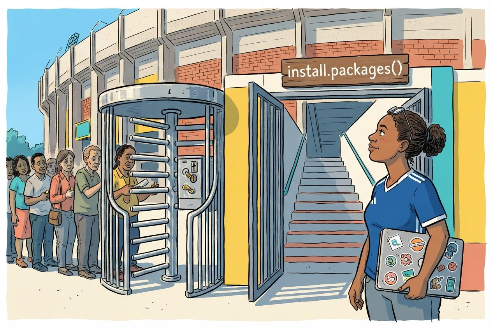

:::::::::::::::::::::::::::::::::::::: questions

- Why should I switch from SPSS to R?
- What can R do that SPSS cannot?
- How much does SPSS actually cost compared to R?

::::::::::::::::::::::::::::::::::::::::::::::::

::::::::::::::::::::::::::::::::::::: objectives

- Describe the practical advantages of R over SPSS for research
- See live examples of R capabilities that go beyond SPSS
- Understand the cost and reproducibility arguments for switching

::::::::::::::::::::::::::::::::::::::::::::::::

{alt="Cartoon of a researcher at a Caribbean crossroads choosing between a cracked SPSS path and a paved R path leading to the coast"}

## Introduction

This episode is a motivational opening. You will **not** write any code yourself
yet. Sit back and watch the instructor demonstrate what R can do. By the end you
should have a clear picture of *why* learning R is worth the investment of your
time.

### The question the course is built around

Curaçao has about 149,000 residents. In 2026 it put a national team into the
World Cup, unbeaten through CONCACAF qualifying. Of the 26 players in that
squad, not one plays club football on the island. They are spread across ten
countries.

That is a striking fact, and it is a data fact before it is a football fact.
Where do the players actually play? How does the men's squad compare with the
women's, and how does Curaçao compare with Aruba, which has a similar history
and builds its squad differently? Every one of those questions is a table, a
filter, a group summary, and a chart. By the end of Wednesday morning you will be
answering them yourself, from a script you wrote.

### What you will be able to produce

The instructor will show you a finished squad report: a single R Markdown file
that reads the squad data, computes the numbers, draws the charts, and renders
to a polished document. It is the kind of thing that ordinarily takes an
afternoon of copy-paste between Excel, SPSS output, and Word. Here it is one
file and one click, and when the squad changes you rerun it.

In Episode 6 you will build a smaller version of the same thing yourself.

### What you will see

The instructor will demonstrate four things that are impossible or impractical
in SPSS:

1. **Pulling a live research dataset**, the DCDC Network's small-island
   reference list, maintained on GitHub at the University of Aruba, straight
   into R with no browser involved.
2. **Creating a publication-quality chart** in under 10 lines of code.
3. **A reproducible report** that updates automatically when new data arrives.
4. **An interactive dashboard** built entirely in R.

If any of those sound appealing, you are in the right place.

## The cost argument

Let us start with the most concrete reason. SPSS is expensive, especially for
small island institutions that pay per seat.

| | **SPSS Standard** | **R + RStudio** |
|---|---|---|
| License type | Annual subscription | Free, open-source |
| Cost per user per year | USD 1,170 to 5,730 (varies by tier) | USD 0 |
| 5-year cost for 5 users | USD 29,250 to 143,250 | USD 0 |
| Runs on | Windows, Mac | Windows, Mac, Linux, cloud |
| Updates | Paid upgrades | Continuous, free |

For a university department in the Dutch Caribbean with three SPSS licenses,
that is easily ANG 10,000 or more per year that could go to research funding,
student assistants, or conference travel instead.

::::::::::::::::::::::::::::::::::::: callout

## "But my institution already pays for SPSS"

That is true today. Institutional budgets change, and when you graduate or
change jobs your personal SPSS license disappears. R stays with you: on your
laptop, on a cloud server, on a Raspberry Pi if you want. Your scripts will
still run in 10 years.

::::::::::::::::::::::::::::::::::::::::::::::::

## What R gives you that SPSS does not

### Reproducibility

In SPSS a typical workflow looks like this: open a dataset, click through menus,
copy output into Word, repeat. If your supervisor asks "can you re-run this with
the updated data?", you have to remember every click.

In R your entire analysis lives in a script. You change one line, the file path,
and re-run. Every step is documented.

### Packages

SPSS has a fixed set of procedures. R has over 20,000 add-on packages on CRAN
alone, covering everything from Bayesian statistics to text mining to geographic
mapping. If a method exists, there is probably an R package for it.

### Automation

Need to run the same analysis on 50 files? In SPSS that means 50 times through
the menus, or learning SPSS syntax, which few people do. In R it is a three-line
loop.

### Communication

R Markdown and Quarto let you combine narrative text, code, and output into a
single document: a PDF, a Word file, a website, or a slideshow. This lesson
itself was built with R.

### Career value

Data science job postings almost never list SPSS. R and Python dominate. Even
within academia, journals increasingly expect reproducible code alongside
submissions.

## Live demonstration

The instructor will now run a live demonstration. Watch the screen.

::::::::::::::::::::::::::::::::::::: callout

## What is happening on screen

Do not worry about understanding the code right now. The goal is to see what is
*possible*. You will learn the building blocks starting in the next episode.

::::::::::::::::::::::::::::::::::::::::::::::::

:::::::::::::::::::::::::::::::::::::::::::::::::::::::::::::::::::: instructor

## Live demo script

This is the complete script to run live. **Practice this before the workshop.**
Make sure `tidyverse` is installed. Everything the demo needs comes with it.

The demo has two halves. The first shows R reaching out to a live research
dataset the network owns. The second lands the local hook on the squad data the
rest of the course uses. Run the first if the Wi-Fi is cooperating, and the
second regardless, because the second is the one that makes the room lean
forward.

### Part A, step 1: Frame the source before you type

Before the first keystroke, name what the room is about to see. The CSV about to
load is in a GitHub repository maintained at the University of Aruba,
`island-research-reference-data`, part of the DCDC Network's shared
infrastructure for island research. It is not a third-party service you hope
stays up. It is research data the network owns and curates. That framing
matters. The payoff is not just that R can read a URL. It is that the data layer
underneath belongs to us.

### Part A, step 2: Pull the SIDS reference list

Open a new R script in RStudio and type or paste the following. Run it line by
line so participants can watch each step.


``` r
# Load packages (install tidyverse once, before the workshop)
# install.packages("tidyverse")
library(tidyverse)

# Pull the UA island-research reference list straight from GitHub
countries <- read_csv(
  "https://raw.githubusercontent.com/University-of-Aruba/island-research-reference-data/main/countries/countries_reference_xlsform.csv"
)

# Quick look at what we got
head(countries)
```

Pause. Point out: "No browser. No download dialog. No save-as. The file is now a
live object in my session, with over a dozen columns per country."

### Part A, step 3: Filter to SIDS and chart by region


``` r
countries |>
  filter(is_sids == 1) |>
  count(wb_region) |>
  ggplot(aes(x = reorder(wb_region, n), y = n)) +
  geom_col(fill = "#44759e") +
  coord_flip() +
  labs(
    title = "Small island developing states by World Bank region",
    x = NULL,
    y = "Number of SIDS"
  ) +
  theme_minimal(base_size = 14)
```

Pause again. Key talking points:

- "This chart is ready for a report as it stands. Title, axis labels, colour,
  proportions, all set in code."
- "If the UA team adds a country to the reference list tomorrow, I re-run this
  script and the chart updates. No re-click, no re-export."
- "Every editorial choice, what counts as a SIDS and which region goes where, is
  traceable, because the definitions sit in the source CSV you just pulled."

### Part B: the local hook

This is the moment the course earns the room's attention. Load the squad data
and answer the question the island already argues about.


``` r
squad <- read_csv("data/blue_wave_squad.csv")

squad |>
  filter(team_code == "CUW-M") |>
  count(club_country, sort = TRUE)
```

Read the result out loud. Then draw it:


``` r
squad |>
  mutate(
    island = if_else(str_starts(team_code, "CUW"), "Curaçao", "Aruba"),
    home_code = if_else(str_starts(team_code, "CUW"), "CUW", "ABW"),
    region = case_when(
      club_country == "X"       ~ "Unknown",
      club_country == home_code ~ "Home island",
      club_country == "NLD"     ~ "Netherlands",
      club_country == "USA"     ~ "North America",
      club_country %in% c("GBR", "GRC", "TUR", "DEU", "BEL", "CHE", "XKX") ~ "Rest of Europe",
      .default                  = "Rest of world"
    )
  ) |>
  count(island, region) |>
  ggplot(aes(x = island, y = n, fill = region)) +
  geom_col(position = "fill") +
  scale_y_continuous(labels = scales::percent) +
  labs(
    title = "Where the players actually play",
    subtitle = "All four ABC island national squads, 2026",
    x = NULL, y = NULL, fill = NULL
  ) +
  theme_minimal(base_size = 14)
```

Talking point: "Two islands, 80 kilometres apart, with populations and colonial
histories that track each other closely. Both send most of their players abroad.
But look where. Curaçao's are scattered across ten countries. Aruba's are
overwhelmingly in one. Nobody in this room needed a statistician to care about
that question. What you needed was a way to ask it, and you just watched it take
twelve lines."

Do not resolve the question. Let the room argue. Say: "By Wednesday you will be
able to run this yourself, and change it to ask what you actually want to know."

### Step 4: Show the contrast with SPSS

Ask the audience: "How would you have done this in SPSS?"

Walk through it slowly. Make it sting a little. This is the moment the cost of
the current workflow lands.

1. Go looking for the squad lists. Wikipedia? FotMob? The federation's Facebook
   page? Pick one and hope it is current.
2. Copy 94 player names, clubs, and positions into Excel by hand. An hour if
   you are quick and do not lose concentration.
3. Discover that the club's country is only shown as a little flag you cannot
   copy, that two players have no club listed at all, and that Jong Holland is a
   Curaçao club despite the name. Clean by hand.
4. Import into SPSS. Recode club country into a grouping variable, because the
   raw text is unusable as it stands.
5. **Analyze > Descriptive Statistics > Frequencies**. Copy the output table.
6. **Graphs > Chart Builder**, drag variables, format the chart, copy, paste
   into Word.

Then say: "That is half a morning, on a good day. In R it was twelve lines and
ten seconds, and the next person who asks gets the same answer from the same
file."

### Backup plan

If the Wi-Fi is unreliable, the reference list is saved locally at
`episodes/data/countries_backup.csv`. Swap the `read_csv()` call for the local
path:


``` r
countries <- read_csv("data/countries_backup.csv")
```

Then proceed with the `filter() |> count() |> ggplot()` pipeline as normal. Part
B is local already and needs no network at all, which is why it is the half you
never skip.

::::::::::::::::::::::::::::::::::::::::::::::::::::::::::::::::::::::::::::::::

## Summary

You have now seen R:

- **Pull live data** from the internet with a single function call
- **Create a publication-ready chart** in 10 lines of code
- Answer a question about your own island from a dataset you can inspect
- Do all of it in a way that is **fully reproducible**

Starting in the next episode you will learn to do these things yourself, one
step at a time.

::::::::::::::::::::::::::::::::::::: keypoints

- R is free, open-source, and runs on any operating system
- R scripts make your analysis fully reproducible
- R can pull data from APIs, create interactive visualizations, and automate reports, which SPSS cannot do
- Switching builds on your existing statistical knowledge rather than replacing it

::::::::::::::::::::::::::::::::::::::::::::::::
