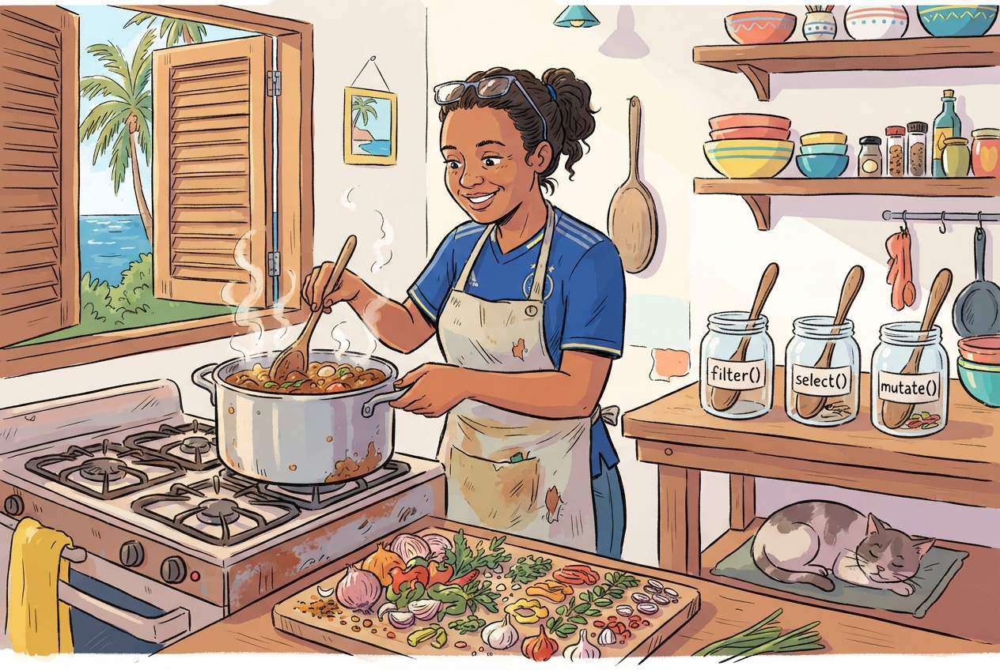

:::::::::::::::::::::::::::::::::::::: questions

- How do I filter, sort, and recode data in R the way I do in SPSS?
- What is the tidyverse and why does it matter?
- How do I create new variables from existing ones?

::::::::::::::::::::::::::::::::::::::::::::::::

::::::::::::::::::::::::::::::::::::: objectives

- Filter rows, select columns, and sort data using dplyr
- Create new variables and recode existing ones
- Chain operations together using the pipe operator
- Recognize the SPSS menu equivalent for each operation

::::::::::::::::::::::::::::::::::::::::::::::::

{alt="Cartoon of a researcher as a Caribbean chef with jars labeled filter(), select(), and mutate(), cooking a pot of tidy data"}

## The tidyverse approach

In SPSS you manipulate data through menus: **Data > Select Cases**, **Data >
Sort Cases**, **Transform > Compute Variable**, and so on. In R the `dplyr`
package gives you a set of **verbs**, functions with plain-English names that do
exactly what they say.

The `dplyr` package is part of the **tidyverse**, which you already loaded in
the previous episode. If you are starting a fresh R session, load it now:


``` r
library(tidyverse)
```

``` output
── Attaching core tidyverse packages ──────────────────────── tidyverse 2.0.0 ──
✔ dplyr     1.2.1     ✔ readr     2.2.0
✔ forcats   1.0.1     ✔ stringr   1.6.0
✔ ggplot2   4.0.3     ✔ tibble    3.3.1
✔ lubridate 1.9.5     ✔ tidyr     1.3.2
✔ purrr     1.2.2     
── Conflicts ────────────────────────────────────────── tidyverse_conflicts() ──
✖ dplyr::filter() masks stats::filter()
✖ dplyr::lag()    masks stats::lag()
ℹ Use the conflicted package (<http://conflicted.r-lib.org/>) to force all conflicts to become errors
```

``` r
# Also load our dataset
squad <- read_csv("data/blue_wave_squad.csv")
```

``` output
Rows: 94 Columns: 5
── Column specification ────────────────────────────────────────────────────────
Delimiter: ","
chr (5): team_code, player_name, position, club, club_country

ℹ Use `spec()` to retrieve the full column specification for this data.
ℹ Specify the column types or set `show_col_types = FALSE` to quiet this message.
```

::::::::::::::::::::::::::::::::::::: callout

## What is a dependency?

A package in R is a bundle of code that someone else wrote so you do not have
to. `tidyverse`, for example, is a collection of packages that work together for
data manipulation and visualisation. When you use `library(tidyverse)`, R loads
those packages into your session so their functions become available.

A dependency is a package that another package needs in order to work.
`tidyverse` depends on `dplyr`, `ggplot2`, `readr`, and several others. When you
run `install.packages("tidyverse")`, R automatically installs everything it
depends on too. You do not have to manage the chain manually.

Two things this means in practice. First, the first time you install a package
it can take a minute or two because R is pulling down the dependency chain. That
is normal. Second, when you share your script with a colleague and they get an
error like `there is no package called 'dplyr'`, the fix is almost always
`install.packages("tidyverse")`, not `install.packages("dplyr")`, because the
dependency lives inside the larger package.

We come back to this in Episode 6, reproducible reporting, where recording which
packages your script needs is part of making sure it still runs six months from
now.

::::::::::::::::::::::::::::::::::::::::::::::::

Here is the key idea: every SPSS menu operation you use for data manipulation
has a dplyr verb equivalent.

| SPSS menu path | dplyr verb | What it does |
|---|---|---|
| Data > Select Cases | `filter()` | Keep rows that match a condition |
| *(selecting columns in Variable View)* | `select()` | Keep or drop columns |
| Transform > Compute Variable | `mutate()` | Create or modify a column |
| Transform > Recode into Different Variables | `case_when()` | Assign values based on conditions |
| Data > Sort Cases | `arrange()` | Sort rows |
| Data > Split File + Aggregate | `group_by()` + `summarise()` | Calculate summaries by group |

Let us work through each one.

## `filter()`, Select Cases

In SPSS you would go to **Data > Select Cases**, click "If condition is
satisfied", and type a condition. In R:


``` r
curacao_men <- filter(squad, team_code == "CUW-M")
curacao_men
```

``` output
# A tibble: 26 × 5
   team_code player_name       position club             club_country
   <chr>     <chr>             <chr>    <chr>            <chr>       
 1 CUW-M     Armando Obispo    DEF      PSV              NLD         
 2 CUW-M     Deveron Fonville  DEF      NEC              NLD         
 3 CUW-M     Joshua Brenet     DEF      Kayserispor      TUR         
 4 CUW-M     Juriën Gaari      DEF      Abha             SAU         
 5 CUW-M     Riechedly Bazoer  DEF      Konyaspor        TUR         
 6 CUW-M     Roshon van Eijma  DEF      A.E. Kifisia     GRC         
 7 CUW-M     Sherel Floranus   DEF      PEC Zwolle       NLD         
 8 CUW-M     Shurandy Sambo    DEF      Sparta Rotterdam NLD         
 9 CUW-M     Brandley Kuwas    FWD      Volendam         NLD         
10 CUW-M     Gervane Kastaneer FWD      Terengganu       MYS         
# ℹ 16 more rows
```

Notice the **double equals sign** `==`. This is how R tests equality. A single
`=` is for assigning values to function arguments, like `digits = 1`. A double
`==` asks "is this equal to?".

You can combine conditions. Listing them separated by commas means "and":


``` r
# Curaçao men who play in the Netherlands
cuw_nld <- filter(squad, team_code == "CUW-M", club_country == "NLD")
cuw_nld
```

``` output
# A tibble: 10 × 5
   team_code player_name         position club             club_country
   <chr>     <chr>               <chr>    <chr>            <chr>       
 1 CUW-M     Armando Obispo      DEF      PSV              NLD         
 2 CUW-M     Deveron Fonville    DEF      NEC              NLD         
 3 CUW-M     Sherel Floranus     DEF      PEC Zwolle       NLD         
 4 CUW-M     Shurandy Sambo      DEF      Sparta Rotterdam NLD         
 5 CUW-M     Brandley Kuwas      FWD      Volendam         NLD         
 6 CUW-M     Trevor Doornbusch   GK       VVV-Venlo        NLD         
 7 CUW-M     Tyrick Bodak        GK       Vitesse          NLD         
 8 CUW-M     Godfried Roemeratoe MID      RKC Waalwijk     NLD         
 9 CUW-M     Juninho Bacuna      MID      Volendam         NLD         
10 CUW-M     Kevin Felida        MID      Den Bosch        NLD         
```


``` r
# Every player in the dataset based on one of the two islands
home_based <- filter(squad, club_country %in% c("CUW", "ABW"))
home_based
```

``` output
# A tibble: 16 × 5
   team_code player_name           position club           club_country
   <chr>     <chr>                 <chr>    <chr>          <chr>       
 1 ARU-M     Diederick Luydens     DEF      Dakota         ABW         
 2 ARU-M     Nickenson Paul        DEF      Dakota         ABW         
 3 ARU-M     Josthan Maduro        GK       SV Britannia   ABW         
 4 ARU-W     Joyce Chen            DEF      SV Racing Club ABW         
 5 ARU-W     Sofia Mora            DEF      SV Bubali      ABW         
 6 ARU-W     Zyana Rogers          FWD      SV Britannia   ABW         
 7 ARU-W     Dylana Veenstra       GK       SV Britannia   ABW         
 8 ARU-W     Jennifer Henao        MID      SV Britannia   ABW         
 9 ARU-W     Kim Schoppema         MID      SV Britannia   ABW         
10 CUW-W     Charnainelys Andrea   DEF      Excellence     CUW         
11 CUW-W     Ignarda Pieternella   DEF      Victory Boys   CUW         
12 CUW-W     Ruwenna Cristina      DEF      UNDEBA         CUW         
13 CUW-W     Gervionna Martina     FWD      Victory Boys   CUW         
14 CUW-W     Kingnaichely Provence GK       Jong Holland   CUW         
15 CUW-W     Thiheyna Susana       GK       Undeba         CUW         
16 CUW-W     Riesmarly Tokaay      MID      Victory Boys   CUW         
```

That last result is worth a pause. Run it and look at which team codes appear.

::::::::::::::::::::::::::::::::::::: callout

## Common comparison operators

| Operator | Meaning | Example |
|---|---|---|
| `==` | equal to | `position == "GK"` |
| `!=` | not equal to | `club_country != "NLD"` |
| `>` | greater than | `year > 2020` |
| `<` | less than | `age < 21` |
| `>=` | greater than or equal to | `year >= 2021` |
| `<=` | less than or equal to | `rank <= 100` |
| `%in%` | matches one of several values | `position %in% c("DEF", "MID")` |
| `!` | not | `!is.na(club)` |

::::::::::::::::::::::::::::::::::::::::::::::::

## `select()`, keep or drop columns

Sometimes your dataset has more columns than you need. In SPSS you might delete
variables or simply ignore them. In R, `select()` lets you keep only the columns
you want:


``` r
slim <- select(squad, team_code, player_name, position, club_country)
head(slim)
```

``` output
# A tibble: 6 × 4
  team_code player_name       position club_country
  <chr>     <chr>             <chr>    <chr>       
1 ARU-M     Bradley Martis    DEF      NLD         
2 ARU-M     Darryl Bäly       DEF      NLD         
3 ARU-M     Diederick Luydens DEF      ABW         
4 ARU-M     Gladwin Curiel    DEF      XKX         
5 ARU-M     Kymani Nedd       DEF      NLD         
6 ARU-M     Nickenson Paul    DEF      ABW         
```

You can also drop columns by putting a minus sign in front:


``` r
no_club <- select(squad, -club)
head(no_club)
```

``` output
# A tibble: 6 × 4
  team_code player_name       position club_country
  <chr>     <chr>             <chr>    <chr>       
1 ARU-M     Bradley Martis    DEF      NLD         
2 ARU-M     Darryl Bäly       DEF      NLD         
3 ARU-M     Diederick Luydens DEF      ABW         
4 ARU-M     Gladwin Curiel    DEF      XKX         
5 ARU-M     Kymani Nedd       DEF      NLD         
6 ARU-M     Nickenson Paul    DEF      ABW         
```

## `mutate()`, Compute Variable

In SPSS: **Transform > Compute Variable**. You would type a target variable
name, then an expression. In R, `mutate()` creates a new column, or modifies an
existing one.

Our dataset codes the team as a single string like `CUW-M`. That is compact for
storage and useless for analysis. Let us split it into the two things it
actually encodes:


``` r
squad <- mutate(squad,
  island = if_else(str_starts(team_code, "CUW"), "Curaçao", "Aruba"),
  gender = if_else(str_ends(team_code, "M"), "Men", "Women")
)
head(select(squad, team_code, island, gender, player_name))
```

``` output
# A tibble: 6 × 4
  team_code island gender player_name      
  <chr>     <chr>  <chr>  <chr>            
1 ARU-M     Aruba  Men    Bradley Martis   
2 ARU-M     Aruba  Men    Darryl Bäly      
3 ARU-M     Aruba  Men    Diederick Luydens
4 ARU-M     Aruba  Men    Gladwin Curiel   
5 ARU-M     Aruba  Men    Kymani Nedd      
6 ARU-M     Aruba  Men    Nickenson Paul   
```

`if_else()` takes a condition, a value to use when it is true, and a value to
use when it is false. It is the R equivalent of an SPSS `IF` transformation.

You can create multiple columns at once, and a logical column is often the most
useful thing you can make:


``` r
squad <- mutate(squad,
  based_abroad = !(club_country %in% c("CUW", "ABW", "X")),
  club_known   = club != "unknown"
)
head(select(squad, player_name, club_country, based_abroad, club_known))
```

``` output
# A tibble: 6 × 4
  player_name       club_country based_abroad club_known
  <chr>             <chr>        <lgl>        <lgl>     
1 Bradley Martis    NLD          TRUE         TRUE      
2 Darryl Bäly       NLD          TRUE         TRUE      
3 Diederick Luydens ABW          FALSE        TRUE      
4 Gladwin Curiel    XKX          TRUE         TRUE      
5 Kymani Nedd       NLD          TRUE         TRUE      
6 Nickenson Paul    ABW          FALSE        TRUE      
```

::::::::::::::::::::::::::::::::::::: callout

## Why a TRUE/FALSE column is worth making

R treats `TRUE` as 1 and `FALSE` as 0. That means the **mean of a logical column
is a proportion**. Once you have `based_abroad`, the share of a squad playing
abroad is one call to `mean()`. No recoding into dummy variables, no counting by
hand. This trick will save you more time than almost anything else in this
episode.

::::::::::::::::::::::::::::::::::::::::::::::::

::::::::::::::::::::::::::::::::::::: callout

## The decision we just buried in one line

Look again at how `based_abroad` was defined. A player whose `club_country` is
`X`, meaning nobody could establish where they play, is being recorded as
`FALSE`, not abroad. Two players in the Aruba women's squad are in that position.
Every share we calculate from this column is therefore a little lower than the
truth, and nothing in the output says so.

That is not a bug in R. It is an analytical choice, made in passing, that a
reader of your results would never see. The alternative is to say so explicitly:


``` r
squad <- mutate(squad,
  abroad_strict = if_else(club_country == "X", NA, !(club_country %in% c("CUW", "ABW")))
)

# Now R refuses to give you an answer that hides the gap
mean(squad$abroad_strict)
```

``` output
[1] NA
```

``` r
# You have to ask for it deliberately, and say how many you dropped
mean(squad$abroad_strict, na.rm = TRUE)
```

``` output
[1] 0.826087
```

``` r
sum(is.na(squad$abroad_strict))
```

``` output
[1] 2
```

`NA` is R's marker for "missing". Most calculations return `NA` if any input is
missing, which feels obstructive until you realise it is R declining to invent a
number on your behalf. `na.rm = TRUE` overrides it, and you should reach for it
consciously and report what it removed.

We use the simpler `based_abroad` for the rest of this episode because it keeps
the code readable. Now you know what it costs.

::::::::::::::::::::::::::::::::::::::::::::::::

## `case_when()`, Recode into Different Variables

In SPSS: **Transform > Recode into Different Variables**, where you map old
values to new values. In R you use `case_when()` inside `mutate()`.

The `club_country` column holds fourteen different codes plus `X`. For most
questions that is too fine-grained: you do not want a bar chart with fourteen
bars, most of them height one. Let us collapse it into regions:


``` r
squad <- mutate(squad,
  home_code = if_else(island == "Curaçao", "CUW", "ABW"),
  region = case_when(
    club_country == "X"       ~ "Unknown",
    club_country == home_code ~ "Home island",
    club_country == "NLD"     ~ "Netherlands",
    club_country == "USA"     ~ "North America",
    club_country %in% c("GBR", "GRC", "TUR", "DEU", "BEL", "CHE", "XKX") ~ "Rest of Europe",
    .default                  = "Rest of world"
  )
)

table(squad$region)
```

``` output

   Home island    Netherlands  North America Rest of Europe  Rest of world 
            16             54              3             16              3 
       Unknown 
             2 
```

The syntax is `condition ~ value_to_assign`. The `.default` line catches
everything that did not match a previous condition, like the Else box in SPSS
Recode.

::::::::::::::::::::::::::::::::::::: callout

## Order matters, and Unknown is a category

`case_when()` works top to bottom and stops at the first match. That is why the
`club_country == home_code` line sits above the `"NLD"` line: reverse them and
every Dutch-based player would be caught by the Netherlands branch before the
home-island test ever ran. Which happens to be harmless here and would not be if
the home island were the Netherlands.

We also sent `X` to "Unknown" rather than quietly dropping those two players.
Two out of 94 will not move a percentage much, and that is not the point. The
point is that dropping them silently makes every figure you report afterwards
slightly wrong in a way no reader can detect. Keeping the category visible lets
them see the size of the gap and judge for themselves. Do this in your own work,
where the gap will rarely be two rows.

::::::::::::::::::::::::::::::::::::::::::::::::

## `arrange()`, Sort Cases

In SPSS: **Data > Sort Cases**. In R:


``` r
# Sort alphabetically by club (ascending is the default)
head(arrange(squad, club))
```

``` output
# A tibble: 6 × 12
  team_code player_name   position club  club_country island gender based_abroad
  <chr>     <chr>         <chr>    <chr> <chr>        <chr>  <chr>  <lgl>       
1 CUW-M     Roshon van E… DEF      A.E.… GRC          Curaç… Men    TRUE        
2 CUW-M     Jeremy Anton… FWD      A.E.… GRC          Curaç… Men    TRUE        
3 ARU-W     Vanessa Susa… FWD      ADO … NLD          Aruba  Women  TRUE        
4 ARU-M     Dimaggio Sen… MID      AFC … NLD          Aruba  Men    TRUE        
5 CUW-M     Juriën Gaari  DEF      Abha  SAU          Curaç… Men    TRUE        
6 CUW-W     Jeleaugh Rosa MID      Acha… GRC          Curaç… Women  TRUE        
# ℹ 4 more variables: club_known <lgl>, abroad_strict <lgl>, home_code <chr>,
#   region <chr>
```


``` r
# Sort descending with desc()
head(arrange(squad, desc(player_name)))
```

``` output
# A tibble: 6 × 12
  team_code player_name   position club  club_country island gender based_abroad
  <chr>     <chr>         <chr>    <chr> <chr>        <chr>  <chr>  <lgl>       
1 ARU-W     Zyana Rogers  FWD      SV B… ABW          Aruba  Women  FALSE       
2 ARU-M     Walter Benne… MID      SC F… NLD          Aruba  Men    TRUE        
3 ARU-W     Vanessa Susa… FWD      ADO … NLD          Aruba  Women  TRUE        
4 CUW-M     Tyrick Bodak  GK       Vite… NLD          Curaç… Men    TRUE        
5 CUW-M     Tyrese Noslin MID      Barn… GBR          Curaç… Men    TRUE        
6 CUW-M     Trevor Doorn… GK       VVV-… NLD          Curaç… Men    TRUE        
# ℹ 4 more variables: club_known <lgl>, abroad_strict <lgl>, home_code <chr>,
#   region <chr>
```


``` r
# Sort by multiple columns: team first, then position
head(arrange(squad, team_code, position), n = 10)
```

``` output
# A tibble: 10 × 12
   team_code player_name  position club  club_country island gender based_abroad
   <chr>     <chr>        <chr>    <chr> <chr>        <chr>  <chr>  <lgl>       
 1 ARU-M     Bradley Mar… DEF      IJss… NLD          Aruba  Men    TRUE        
 2 ARU-M     Darryl Bäly  DEF      Lisse NLD          Aruba  Men    TRUE        
 3 ARU-M     Diederick L… DEF      Dako… ABW          Aruba  Men    FALSE       
 4 ARU-M     Gladwin Cur… DEF      FC P… XKX          Aruba  Men    TRUE        
 5 ARU-M     Kymani Nedd  DEF      VV Z… NLD          Aruba  Men    TRUE        
 6 ARU-M     Nickenson P… DEF      Dako… ABW          Aruba  Men    FALSE       
 7 ARU-M     Rainey Brei… DEF      Exce… NLD          Aruba  Men    TRUE        
 8 ARU-M     Rovien Osti… DEF      TOGB  NLD          Aruba  Men    TRUE        
 9 ARU-M     Arenchelo L… FWD      RKAV… NLD          Aruba  Men    TRUE        
10 ARU-M     Carlito Fer… FWD      Koza… NLD          Aruba  Men    TRUE        
# ℹ 4 more variables: club_known <lgl>, abroad_strict <lgl>, home_code <chr>,
#   region <chr>
```

## `group_by()` and `summarise()`, Split File and Aggregate

This is one of the most powerful combinations in dplyr, and it replaces two SPSS
operations at once:

- **Data > Split File**, which tells SPSS to run analyses separately for each
  group
- **Data > Aggregate**, which calculates summary statistics by group


``` r
# Share of each squad playing club football off-island
abroad_by_team <- squad |>
  group_by(team_code) |>
  summarise(
    players      = n(),
    share_abroad = mean(based_abroad)
  )
abroad_by_team
```

``` output
# A tibble: 4 × 3
  team_code players share_abroad
  <chr>       <int>        <dbl>
1 ARU-M          23        0.870
2 ARU-W          23        0.652
3 CUW-M          26        1    
4 CUW-W          22        0.682
```

There is the answer to the question Episode 1 opened with, in five lines.

Wait, what is that `|>` symbol? That is the **pipe operator**, and it deserves
its own section.

## The pipe operator `|>`

The pipe `|>` is one of the most important ideas in modern R. Read it as **"and
then"**. It takes the result of the expression on the left and passes it as the
first argument to the function on the right.

Without the pipe you would write:


``` r
# Nested style (hard to read)
summarise(group_by(filter(squad, gender == "Men"), island), share = mean(based_abroad))
```

That is like reading a sentence from the inside out. With the pipe the same code
becomes:


``` r
squad |>
  filter(gender == "Men") |>
  group_by(island) |>
  summarise(share = mean(based_abroad))
```

``` output
# A tibble: 2 × 2
  island  share
  <chr>   <dbl>
1 Aruba   0.870
2 Curaçao 1    
```

Read this as: "Take `squad`, **and then** keep the men's squads, **and then**
group by island, **and then** summarise the share based abroad."

The pipe makes your code read from top to bottom, like a recipe. Each line is
one step.

::::::::::::::::::::::::::::::::::::: callout

## `|>` vs `%>%`

You may see `%>%` in older R code and tutorials. This is the original pipe
operator from the `magrittr` package. The native pipe `|>` was added to base R
in version 4.1 in 2021 and works without loading any packages. They behave
almost identically. We use `|>` in this course because it requires no extra
dependencies.

::::::::::::::::::::::::::::::::::::::::::::::::

### Building up a pipeline step by step

A good workflow is to build your pipeline one step at a time, checking the
result after each line. Let us work through an example.


``` r
# Step 1: Start with the data
squad |>
  filter(island == "Curaçao")
```

``` output
# A tibble: 48 × 12
   team_code player_name  position club  club_country island gender based_abroad
   <chr>     <chr>        <chr>    <chr> <chr>        <chr>  <chr>  <lgl>       
 1 CUW-M     Armando Obi… DEF      PSV   NLD          Curaç… Men    TRUE        
 2 CUW-M     Deveron Fon… DEF      NEC   NLD          Curaç… Men    TRUE        
 3 CUW-M     Joshua Bren… DEF      Kays… TUR          Curaç… Men    TRUE        
 4 CUW-M     Juriën Gaari DEF      Abha  SAU          Curaç… Men    TRUE        
 5 CUW-M     Riechedly B… DEF      Kony… TUR          Curaç… Men    TRUE        
 6 CUW-M     Roshon van … DEF      A.E.… GRC          Curaç… Men    TRUE        
 7 CUW-M     Sherel Flor… DEF      PEC … NLD          Curaç… Men    TRUE        
 8 CUW-M     Shurandy Sa… DEF      Spar… NLD          Curaç… Men    TRUE        
 9 CUW-M     Brandley Ku… FWD      Vole… NLD          Curaç… Men    TRUE        
10 CUW-M     Gervane Kas… FWD      Tere… MYS          Curaç… Men    TRUE        
# ℹ 38 more rows
# ℹ 4 more variables: club_known <lgl>, abroad_strict <lgl>, home_code <chr>,
#   region <chr>
```


``` r
# Step 2: Add a column selection
squad |>
  filter(island == "Curaçao") |>
  select(gender, player_name, position, club, region)
```

``` output
# A tibble: 48 × 5
   gender player_name       position club             region        
   <chr>  <chr>             <chr>    <chr>            <chr>         
 1 Men    Armando Obispo    DEF      PSV              Netherlands   
 2 Men    Deveron Fonville  DEF      NEC              Netherlands   
 3 Men    Joshua Brenet     DEF      Kayserispor      Rest of Europe
 4 Men    Juriën Gaari      DEF      Abha             Rest of world 
 5 Men    Riechedly Bazoer  DEF      Konyaspor        Rest of Europe
 6 Men    Roshon van Eijma  DEF      A.E. Kifisia     Rest of Europe
 7 Men    Sherel Floranus   DEF      PEC Zwolle       Netherlands   
 8 Men    Shurandy Sambo    DEF      Sparta Rotterdam Netherlands   
 9 Men    Brandley Kuwas    FWD      Volendam         Netherlands   
10 Men    Gervane Kastaneer FWD      Terengganu       Rest of world 
# ℹ 38 more rows
```


``` r
# Step 3: Group and summarise
squad |>
  filter(island == "Curaçao") |>
  count(gender, region) |>
  arrange(gender, desc(n))
```

``` output
# A tibble: 8 × 3
  gender region             n
  <chr>  <chr>          <int>
1 Men    Rest of Europe    11
2 Men    Netherlands       10
3 Men    Rest of world      3
4 Men    North America      2
5 Women  Netherlands       12
6 Women  Home island        7
7 Women  Rest of Europe     2
8 Women  North America      1
```

This pipeline reads: "Take the squad data, keep the Curaçao players, count how
many fall in each combination of gender and tier group, then sort."

`count()` is a shortcut for `group_by()` followed by `summarise(n = n())`. You
will reach for it constantly.

:::::::::::::::::::::::::::::::::::::::::::::::::::::::::::::::::::: instructor

## Teaching tips

- Write the pipe `|>` on the whiteboard and say "and then" out loud every time
  you use it. This mental model sticks.
- Build pipelines live, one step at a time. Run after each added line so
  participants can see how the output changes.
- The most common beginner mistake is putting `|>` at the start of a line
  instead of at the end of the previous line. Emphasise that the pipe goes at
  the **end** of the line, so R knows the expression continues.
- Compare nested function calls to piped code side by side. The readability
  advantage sells itself.
- The `mean()` of a logical is the single highest-leverage idea in this episode.
  SPSS users are trained to build dummy variables by hand. Show them the
  shortcut, then show them the SPSS way they would otherwise have used, and let
  the contrast do the work.
- The `filter(club_country %in% c("CUW", "ABW"))` result usually produces an
  audible reaction in a Curaçao room. Let it. Then say "we are not explaining
  that today, we are learning how to ask it."
- If someone asks why two players have `club_country == "X"`, the honest answer
  is that the source is a Wikipedia squad table, those two rows list no club, and
  the build script recorded that rather than guessing. Point them to
  `blue_wave_squad_codebook.md` in the data folder. This is a good moment for a
  word about documenting your own uncertainty.
- Someone may well ask how current the squads are. They are as current as
  Wikipedia, which is to say: maintained by volunteers, lagging real call-ups by
  weeks or months, and not necessarily consistent across the four pages. Say so.
  It is a better answer than pretending, and it sets up Episode 5.

::::::::::::::::::::::::::::::::::::::::::::::::::::::::::::::::::::::::::::::::

::::::::::::::::::::::::::::::::::::: challenge

## Challenge 1: Where does the Curaçao men's squad play?

Using the `squad` dataset and the pipe operator, write a pipeline that:

1. Filters to the Curaçao men's squad
2. Counts players by `club_country`
3. Sorts from most to fewest

Save the result to an object called `cuw_countries` and print it. How many of
them play their club football on Curaçao?

:::::::::::::::::::::::: solution

## Solution


``` r
cuw_countries <- squad |>
  filter(team_code == "CUW-M") |>
  count(club_country, sort = TRUE)

cuw_countries
```

``` output
# A tibble: 10 × 2
   club_country     n
   <chr>        <int>
 1 NLD             10
 2 GBR              4
 3 TUR              3
 4 GRC              2
 5 USA              2
 6 BEL              1
 7 CHE              1
 8 ISR              1
 9 MYS              1
10 SAU              1
```

None. Not one of the 26 players plays club football on Curaçao. The Netherlands
is the largest single destination with 10, but it is not a majority: the other
16 are scattered across nine more countries, from England and Turkey to Malaysia
and Saudi Arabia.

:::::::::::::::::::::::::::::::::
::::::::::::::::::::::::::::::::::::::::::::::::

::::::::::::::::::::::::::::::::::::: challenge

## Challenge 2: The four-squad comparison

Write a pipeline that, for each of the four squads, reports the number of
players and the share based abroad, sorted from the highest share to the lowest.

Present the share as a rounded percentage rather than a decimal.

:::::::::::::::::::::::: solution

## Solution


``` r
squad |>
  group_by(island, gender) |>
  summarise(
    players   = n(),
    pct_abroad = round(100 * mean(based_abroad)),
    .groups = "drop"
  ) |>
  arrange(desc(pct_abroad))
```

``` output
# A tibble: 4 × 4
  island  gender players pct_abroad
  <chr>   <chr>    <int>      <dbl>
1 Curaçao Men         26        100
2 Aruba   Men         23         87
3 Curaçao Women       22         68
4 Aruba   Women       23         65
```

Both men's squads sit high and both women's squads sit lower, so the sharper
split here is by gender rather than by island. That is worth noticing precisely
because it is not the split you were probably looking for. Episode 5 puts a test
on it.

The island difference is real but it does not live in this column. Both islands
send most of their players abroad; where they send them is the interesting part,
which is what `region` is for.

:::::::::::::::::::::::::::::::::
::::::::::::::::::::::::::::::::::::::::::::::::

::::::::::::::::::::::::::::::::::::: challenge

## Challenge 3: Composition by position

Using the `region` column we created with `case_when()`, write a pipeline
that shows, for the Curaçao men's squad only, how many players fall in each
combination of `position` and `region`. Sort by position and then by count
descending.

Hint: you will need to group by two columns, and `count()` accepts more than one.

:::::::::::::::::::::::: solution

## Solution


``` r
squad |>
  filter(team_code == "CUW-M") |>
  count(position, region) |>
  arrange(position, desc(n))
```

``` output
# A tibble: 11 × 3
   position region             n
   <chr>    <chr>          <int>
 1 DEF      Netherlands        4
 2 DEF      Rest of Europe     3
 3 DEF      Rest of world      1
 4 FWD      Rest of Europe     4
 5 FWD      Rest of world      2
 6 FWD      Netherlands        1
 7 FWD      North America      1
 8 GK       Netherlands        2
 9 GK       North America      1
10 MID      Rest of Europe     4
11 MID      Netherlands        3
```

If you used `group_by()` and `summarise()` instead, add `.groups = "drop"`:


``` r
squad |>
  filter(team_code == "CUW-M") |>
  group_by(position, region) |>
  summarise(n = n(), .groups = "drop") |>
  arrange(position, desc(n))
```

``` output
# A tibble: 11 × 3
   position region             n
   <chr>    <chr>          <int>
 1 DEF      Netherlands        4
 2 DEF      Rest of Europe     3
 3 DEF      Rest of world      1
 4 FWD      Rest of Europe     4
 5 FWD      Rest of world      2
 6 FWD      Netherlands        1
 7 FWD      North America      1
 8 GK       Netherlands        2
 9 GK       North America      1
10 MID      Rest of Europe     4
11 MID      Netherlands        3
```

The `.groups = "drop"` argument tells `summarise()` to remove the grouping after
calculation. Without it the result stays grouped, which causes surprising
behaviour in later steps.

:::::::::::::::::::::::::::::::::
::::::::::::::::::::::::::::::::::::::::::::::::

## Summary

You now know the core dplyr verbs and can map each one to its SPSS equivalent:

| You used to... | Now you write... |
|---|---|
| Data > Select Cases | `filter()` |
| Select columns in Variable View | `select()` |
| Transform > Compute Variable | `mutate()` |
| Transform > Recode | `mutate()` + `case_when()` |
| Data > Sort Cases | `arrange()` |
| Data > Split File + Aggregate | `group_by()` + `summarise()` |

And you connect them all with `|>`, "and then", to build readable, reproducible
data pipelines.

::::::::::::::::::::::::::::::::::::: keypoints

- dplyr verbs (`filter`, `select`, `mutate`, `arrange`, `summarise`) replace SPSS menu operations
- The pipe operator `|>` chains operations together, making code readable
- `group_by()` combined with `summarise()` replaces SPSS Split File + Aggregate
- The mean of a TRUE/FALSE column is a proportion, which saves you building dummy variables
- Keep an explicit Unknown category rather than dropping incomplete rows

::::::::::::::::::::::::::::::::::::::::::::::::
