:::::::::::::::::::::::::::::::::::::: questions

- How do I create charts in R that look better than SPSS Chart Builder output?
- What is the ggplot2 "grammar of graphics" approach?
- How do I customize colors, labels, and themes?

::::::::::::::::::::::::::::::::::::::::::::::::

::::::::::::::::::::::::::::::::::::: objectives

- Build bar charts, histograms, scatterplots, and line charts with ggplot2
- Customize plots with labels, colors, and themes for publication quality
- Compare ggplot2 output with SPSS Chart Builder equivalents
- Create faceted plots to compare groups

::::::::::::::::::::::::::::::::::::::::::::::::

{alt="Cartoon of a researcher painting a tropical sunset onto a ggplot2 canvas with flamingos and plot axes"}

## The grammar of graphics

In SPSS you create charts through the **Chart Builder** dialog: you drag
variables onto axes, pick a chart type, and click OK. The result is a finished
chart, but customizing it requires clicking through many menus.

ggplot2 takes a fundamentally different approach called the **grammar of
graphics**. Instead of picking a finished chart type, you build a plot layer by
layer, like constructing a sentence:

1. **Data**, what data frame are you plotting?
2. **Aesthetics** (`aes()`), which variables map to the x-axis, y-axis, colour, size?
3. **Geometry** (`geom_*()`), what visual marks represent the data: bars, points, lines?
4. **Labels** (`labs()`), what titles and axis labels should appear?
5. **Theme** (`theme_*()`), what overall style should the plot have?

You combine these layers with the `+` operator. First, load our packages and
both datasets:


``` r
library(tidyverse)

squad <- read_csv("data/blue_wave_squad.csv") |>
  mutate(
    island = if_else(str_starts(team_code, "CUW"), "Curaçao", "Aruba"),
    gender = if_else(str_ends(team_code, "M"), "Men", "Women"),
    tier_group = case_when(
      league_tier %in% c("1", "2") ~ "European professional",
      league_tier == "3"           ~ "European amateur or lower",
      league_tier %in% c("R", "Y") ~ "Reserve or youth",
      league_tier == "L"           ~ "Island league",
      .default                     = "Unknown"
    )
  )

fifa <- read_csv("data/fifa_rankings.csv")
```

::::::::::::::::::::::::::::::::::::: callout

## Two datasets, on purpose

The squad file is almost entirely categorical: names, positions, clubs, codes.
The FIFA file is mostly continuous: rank, points, population, diaspora size.
Real chart choices are driven by which of those you have. Working with both in
one episode is how you build the instinct.

`fifa` covers 211 national associations, with Curaçao at rank 82 and Aruba at
189. It has genuine missing values, because population and diaspora estimates do
not exist for every territory. You will meet them.

::::::::::::::::::::::::::::::::::::::::::::::::

Here is the simplest possible ggplot call, just the data and aesthetics, with no
geometry yet:


``` r
ggplot(data = squad, aes(x = tier_group))
```

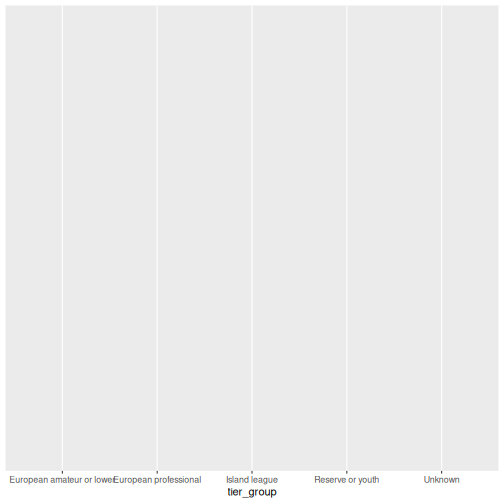

This gives us an empty canvas with axes. Now we add a geometry layer:


``` r
ggplot(data = squad, aes(x = tier_group)) +
  geom_bar()
```

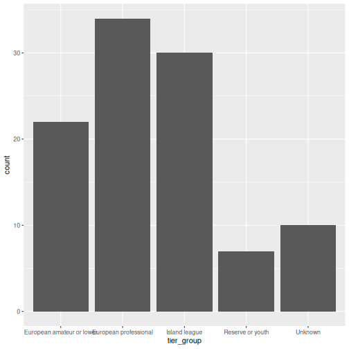

That is already a bar chart. The `+` operator is how you add layers. Think of it
as stacking transparencies on top of each other.

::::::::::::::::::::::::::::::::::::: callout

## The `+` operator vs the pipe `|>`

The pipe `|>` passes data *into* a function. The `+` in ggplot2 *adds layers* to
a plot. They look similar but do different things. A common beginner mistake is
using `|>` where `+` is needed:

```r
# WRONG, this will produce an error
ggplot(squad, aes(x = tier_group)) |> geom_bar()

# CORRECT
ggplot(squad, aes(x = tier_group)) + geom_bar()
```

::::::::::::::::::::::::::::::::::::::::::::::::

## Common chart types

Below is a reference table mapping SPSS Chart Builder chart types to their
ggplot2 equivalents:

| Chart type   | SPSS menu path                          | ggplot2 geometry       |
|--------------|-----------------------------------------|------------------------|
| Bar chart    | Graphs > Chart Builder > Bar            | `geom_bar()` / `geom_col()` |
| Histogram    | Graphs > Chart Builder > Histogram      | `geom_histogram()`     |
| Scatterplot  | Graphs > Chart Builder > Scatter/Dot    | `geom_point()`         |
| Line chart   | Graphs > Chart Builder > Line           | `geom_line()`          |
| Boxplot      | Graphs > Chart Builder > Boxplot        | `geom_boxplot()`       |

### Bar chart: `geom_bar()` and `geom_col()`

There are two bar chart geoms. Use `geom_bar()` when you want R to **count rows**
for you, and `geom_col()` when you already have the **values to plot**.


``` r
# geom_bar() counts the rows in each squad
ggplot(squad, aes(x = team_code)) +
  geom_bar()
```

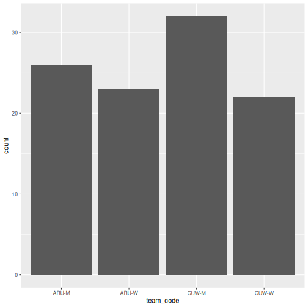


``` r
# geom_col() uses a pre-computed value on the y-axis
abroad <- squad |>
  group_by(team_code) |>
  summarise(pct_abroad = 100 * mean(!(club_country %in% c("CUW", "ABW", "X"))))

ggplot(abroad, aes(x = reorder(team_code, -pct_abroad), y = pct_abroad)) +
  geom_col()
```

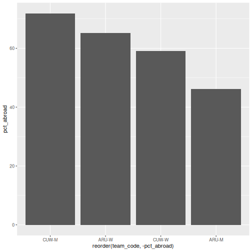

::::::::::::::::::::::::::::::::::::: callout

## `geom_bar()` vs `geom_col()`, when to use which

- `geom_bar()` uses `stat = "count"` by default: it counts how many rows fall
  into each category. You only need an `x` aesthetic.
- `geom_col()` uses `stat = "identity"`: it plots the actual value you supply.
  You need both `x` and `y`.

In SPSS Chart Builder, when you drag a categorical variable to the x-axis and a
scale variable to the y-axis with Mean as the summary, that is equivalent to
first computing the mean with `summarise()` and then using `geom_col()`.

::::::::::::::::::::::::::::::::::::::::::::::::

### Stacked and filled bars

When you map a second categorical variable to `fill`, the bars split. The
`position` argument controls how:


``` r
ggplot(squad, aes(x = team_code, fill = tier_group)) +
  geom_bar()
```

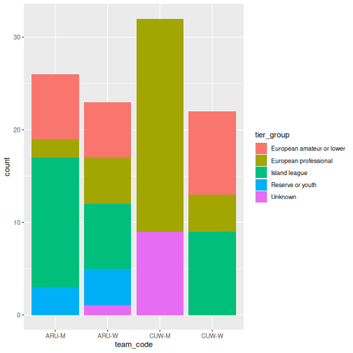


``` r
# position = "fill" converts to proportions, which is what you usually want
ggplot(squad, aes(x = team_code, fill = tier_group)) +
  geom_bar(position = "fill") +
  scale_y_continuous(labels = scales::percent)
```

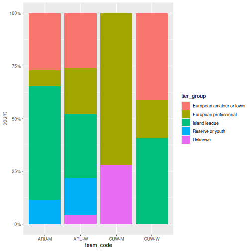

The second chart is the one that answers the question. Counts let squad size
distort the comparison; proportions do not.

### Histogram: `geom_histogram()`

In SPSS: **Graphs > Chart Builder**, drag a scale variable to the x-axis and
select the Histogram type. Here we need a continuous variable, so we switch to
the FIFA data:


``` r
ggplot(fifa, aes(x = points)) +
  geom_histogram(binwidth = 50, color = "white")
```

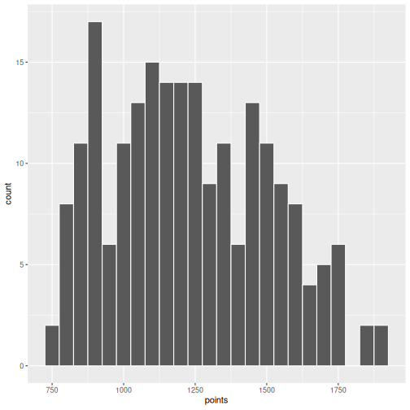

The `binwidth` argument controls how wide each bin is. Experiment with different
values to see how the shape of the distribution changes.

### Scatterplot: `geom_point()`

In SPSS: **Graphs > Chart Builder**, drag variables to x and y axes and select
Simple Scatter.


``` r
ggplot(fifa, aes(x = log_population, y = points)) +
  geom_point()
```

``` warning
Warning: Removed 4 rows containing missing values or values outside the scale range
(`geom_point()`).
```

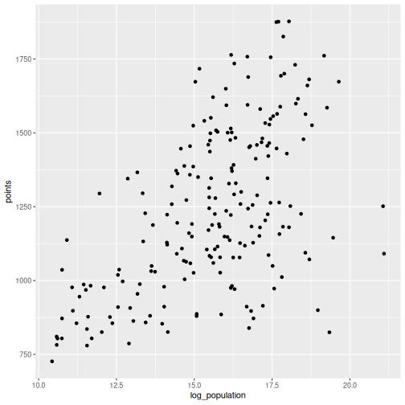

R will warn you that some rows were removed. That is the missing population data
doing its job: ggplot2 refuses to plot a point it cannot place, and it tells you
how many it dropped. Never suppress that warning without reading it first.

You can map additional variables to aesthetics like colour and size:


``` r
ggplot(fifa, aes(x = log_population, y = points, color = small_state)) +
  geom_point(size = 2, alpha = 0.7)
```

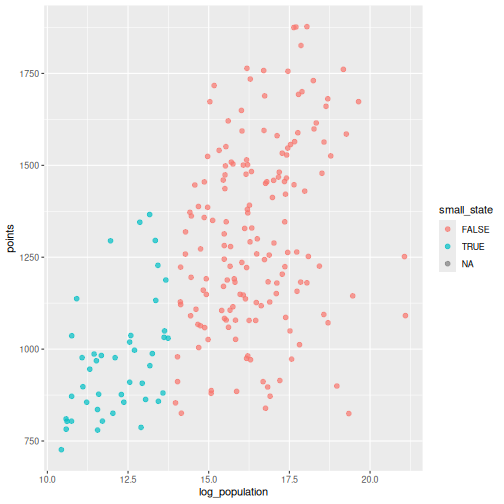

### Drawing attention to specific cases

Often the point of a chart is one or two observations. Build a flag column, then
layer a second `geom_point()` and a text label on top:


``` r
fifa_flag <- fifa |>
  mutate(highlight = iso3 %in% c("CUW", "ABW"))

ggplot(fifa_flag, aes(x = log_population, y = points)) +
  geom_point(color = "grey75", size = 2) +
  geom_point(data = filter(fifa_flag, highlight), color = "#f38439", size = 3.5) +
  geom_text(
    data = filter(fifa_flag, highlight),
    aes(label = country),
    nudge_y = 60, size = 3.5
  ) +
  labs(
    title = "Two islands, one neighbourhood, very different rankings",
    x = "Population (log scale)",
    y = "FIFA points"
  ) +
  theme_minimal(base_size = 13)
```

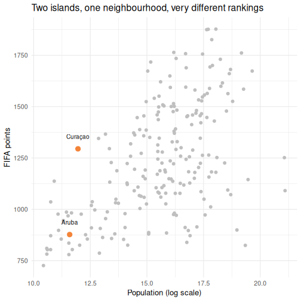

Layers are drawn in the order you write them, so the highlighted points sit on
top of the grey ones. This is the single most useful pattern in this episode for
report work.

### Line chart: `geom_line()`

Line charts show trends over an ordered variable. Our two datasets are both
cross-sections, so here we order countries by rank and trace the points curve:


``` r
top40 <- fifa |>
  filter(rank <= 40) |>
  arrange(rank)

ggplot(top40, aes(x = rank, y = points)) +
  geom_line() +
  geom_point(size = 1) +
  labs(x = "FIFA rank", y = "FIFA points")
```

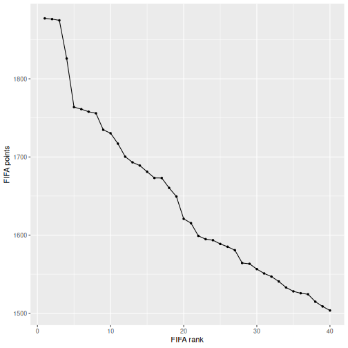

### Boxplot: `geom_boxplot()`

In SPSS: **Graphs > Chart Builder**, select Boxplot and drag a grouping variable
to the x-axis and a scale variable to the y-axis.


``` r
fifa |>
  filter(!is.na(small_state)) |>
  ggplot(aes(x = small_state, y = points)) +
  geom_boxplot() +
  labs(x = "Population under 1 million", y = "FIFA points")
```

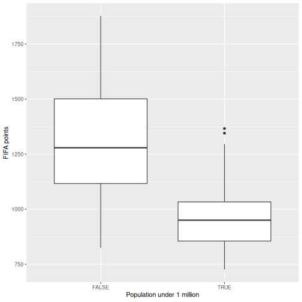

## Making it publication-ready

So far our plots have been functional but plain. Let us take the squad
composition chart through the full journey from basic to polished. This is where
ggplot2 outshines SPSS Chart Builder: every tweak is a single line of code.

**Step 1: Basic chart**


``` r
p <- ggplot(squad, aes(x = team_code, fill = tier_group)) +
  geom_bar(position = "fill")
p
```

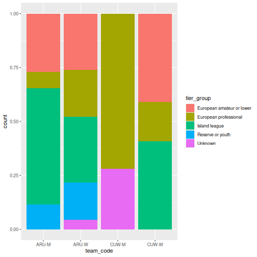

**Step 2: Add labels**


``` r
p <- p +
  labs(
    title = "Where the ABC islands' footballers actually play",
    subtitle = "Share of each 2026 national squad by level of club football",
    x = NULL,
    y = NULL,
    fill = NULL,
    caption = "Source: Cornerstone Economics squad dataset, 2026"
  )
p
```

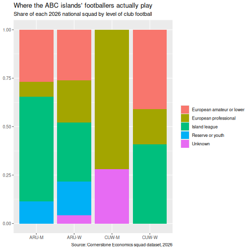

**Step 3: Apply a clean theme**


``` r
p <- p + theme_minimal(base_size = 13)
p
```

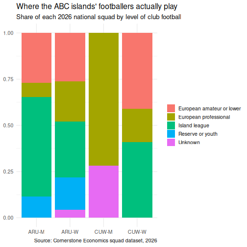

**Step 4: Customize colours**

Rather than accepting the default palette, set one deliberately. These are the
LovelyData colours used across DCDC materials:


``` r
tier_colours <- c(
  "European professional"     = "#44759e",
  "European amateur or lower" = "#749c4c",
  "Reserve or youth"          = "#dee3c8",
  "Island league"             = "#f38439",
  "Unknown"                   = "#605b54"
)

p <- p + scale_fill_manual(values = tier_colours)
p
```

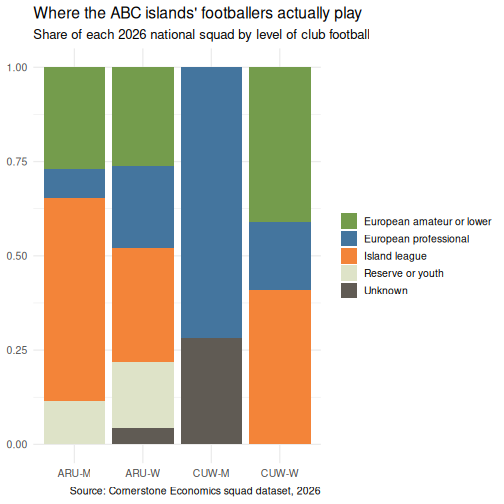

**Step 5: Fine-tune text and formatting**


``` r
p <- p +
  scale_y_continuous(labels = scales::percent) +
  theme(
    plot.title = element_text(face = "bold"),
    legend.position = "bottom",
    panel.grid.major.x = element_blank()
  )
p
```

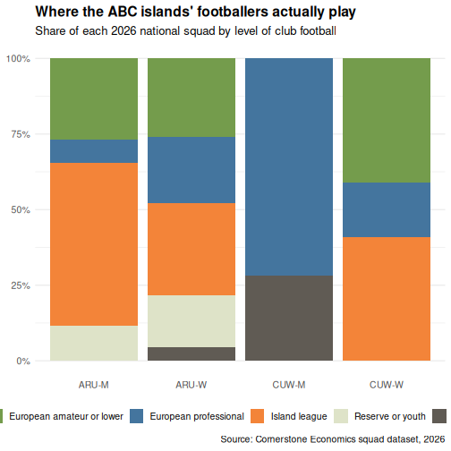

::::::::::::::::::::::::::::::::::::: callout

## Saving your plot

Use `ggsave()` to export your plot as a PNG, PDF, or SVG file:

```r
ggsave("squad_composition.png", plot = p, width = 8, height = 5, dpi = 300)
```

In SPSS you right-click the chart and choose Export. `ggsave()` gives you
precise control over dimensions and resolution, which is exactly what journals
require.

::::::::::::::::::::::::::::::::::::::::::::::::

## Faceting: small multiples

Faceting is one of ggplot2's most powerful features and something SPSS Chart
Builder handles poorly. Instead of cramming all groups onto one chart, you split
the data into panels, one per group.


``` r
squad |>
  count(island, gender, tier_group) |>
  ggplot(aes(x = tier_group, y = n, fill = tier_group)) +
  geom_col() +
  facet_grid(gender ~ island) +
  scale_fill_manual(values = tier_colours) +
  coord_flip() +
  labs(
    title = "Squad composition by island and gender",
    x = NULL, y = "Players"
  ) +
  theme_minimal(base_size = 12) +
  theme(legend.position = "none")
```

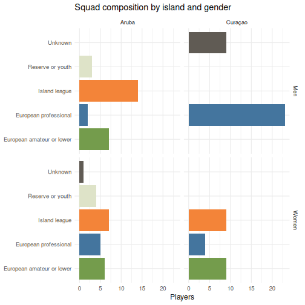

`facet_grid(gender ~ island)` lays out rows by gender and columns by island, so
you can read down a column to compare within an island and across a row to
compare between them. `facet_wrap()` is the alternative when you have one
grouping variable and just want the panels to flow.

:::::::::::::::::::::::::::::::::::::::::::: instructor

## Instructor note

The faceting example is a good place to pause and let learners experiment.
Encourage them to try:

- `facet_wrap(~ island, ncol = 1)` to control the layout
- swapping the facet formula to `facet_grid(island ~ gender)` and asking which
  comparison each version makes easy
- removing `coord_flip()` to see why the labels needed it

The `position = "fill"` versus default stacking contrast is the most transferable
idea in the episode. Most people in the room have at some point presented a
counts chart where the group sizes differed, and drawn a conclusion from bar
height that the proportions did not support. Say that out loud.

Do not skip past the missing-data warning on the first scatterplot. Learners who
have been taught to make warnings go away need to hear, from you, that this
particular one is information.

::::::::::::::::::::::::::::::::::::::::::::::::::::::::

::::::::::::::::::::::::::::::::::::: challenge

## Challenge 1: Build a publication-quality highlighted scatterplot

Using the `fifa` data, create a scatterplot of `log_population` (x-axis) against
`rank` (y-axis) with the following requirements:

1. All countries in grey
2. Curaçao, Aruba, Jamaica, and Suriname highlighted and labelled
3. A linear trend line across all countries using `geom_smooth(method = "lm")`
4. The y-axis reversed, so rank 1 is at the top where it belongs
5. A proper title, axis labels, and caption, with `theme_minimal()` and a bold title

:::::::::::::::::::::::: solution

## Solution


``` r
focus <- c("CUW", "ABW", "JAM", "SUR")

fifa_c1 <- fifa |>
  mutate(highlight = iso3 %in% focus)

ggplot(fifa_c1, aes(x = log_population, y = rank)) +
  geom_point(color = "grey78", size = 2) +
  geom_smooth(method = "lm", se = FALSE, color = "#605b54", linewidth = 0.7) +
  geom_point(data = filter(fifa_c1, highlight), color = "#f38439", size = 3.5) +
  geom_text(
    data = filter(fifa_c1, highlight),
    aes(label = country), nudge_y = -9, size = 3.4
  ) +
  scale_y_reverse() +
  labs(
    title = "Population predicts FIFA rank, loosely",
    subtitle = "Curaçao sits far above the line for its size; Aruba sits below it",
    x = "Population (log scale)",
    y = "FIFA rank",
    caption = "Source: FIFA rankings and UN population estimates"
  ) +
  theme_minimal(base_size = 12) +
  theme(plot.title = element_text(face = "bold"))
```

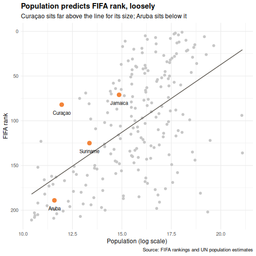

`scale_y_reverse()` matters more than it looks. Rank is a variable where smaller
is better, and a chart that puts rank 1 at the bottom will be misread by half
your audience.

:::::::::::::::::::::::::::::::::
::::::::::::::::::::::::::::::::::::::::::::::::

::::::::::::::::::::::::::::::::::::: challenge

## Challenge 2: Recreate an SPSS-style chart

In SPSS a common chart is a clustered bar chart showing a summary by group.
Create the R equivalent using the squad data: a clustered bar chart showing the
**percentage of each squad based abroad**, with island on the x-axis and bars
clustered by gender.

*Hint:* compute the percentage first with `group_by()` and `summarise()`, then
use `geom_col(position = "dodge")`.

:::::::::::::::::::::::: solution

## Solution


``` r
squad |>
  group_by(island, gender) |>
  summarise(
    pct_abroad = 100 * mean(!(club_country %in% c("CUW", "ABW", "X"))),
    .groups = "drop"
  ) |>
  ggplot(aes(x = island, y = pct_abroad, fill = gender)) +
  geom_col(position = "dodge", width = 0.7) +
  scale_fill_manual(values = c("Men" = "#44759e", "Women" = "#f38439")) +
  labs(
    title = "Share of each squad playing club football off-island",
    x = NULL,
    y = "Percent of squad",
    fill = NULL
  ) +
  theme_minimal(base_size = 12) +
  theme(
    plot.title = element_text(face = "bold"),
    legend.position = "bottom"
  )
```

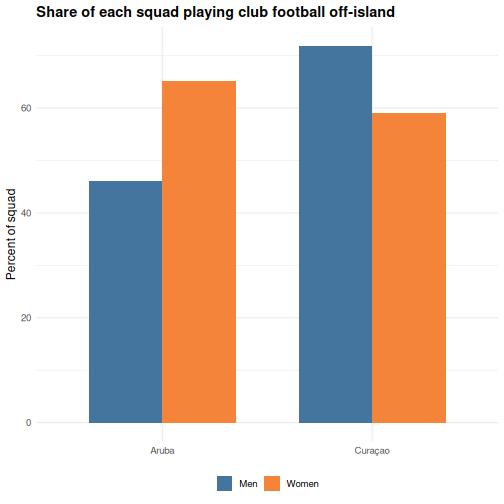

Look at the direction of the gender gap on each island. It does not point the
same way on both, which is the kind of thing a single-number summary would have
hidden from you.

:::::::::::::::::::::::::::::::::
::::::::::::::::::::::::::::::::::::::::::::::::

::::::::::::::::::::::::::::::::::::: keypoints

- ggplot2 builds plots in layers: data, aesthetics, geometry, labels, theme
- Every SPSS Chart Builder chart has a ggplot2 equivalent that offers more control
- `position = "fill"` turns counts into proportions, which is usually the honest comparison
- Highlight specific cases by layering a second `geom_point()` over a grey base
- Faceting (`facet_wrap`, `facet_grid`) creates small multiples, which SPSS Chart Builder handles poorly

::::::::::::::::::::::::::::::::::::::::::::::::
