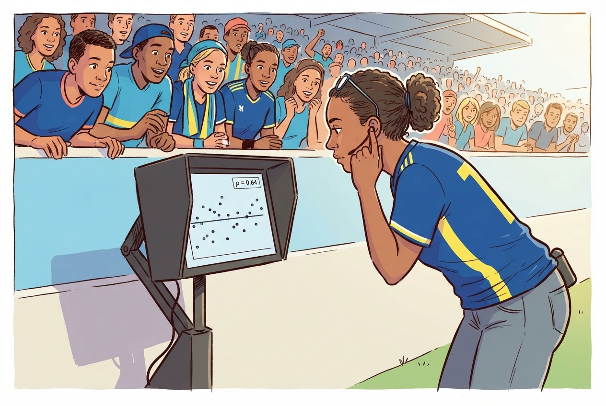
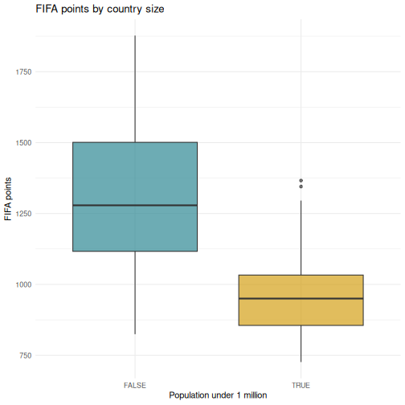
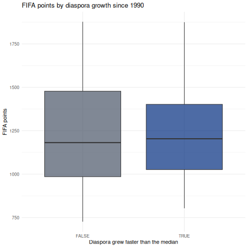
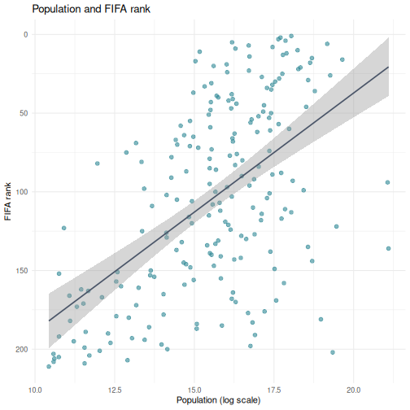

:::::::::::::::::::::::::::::::::::::: questions

- How do I run t-tests, correlations, and regression in R?
- How does R output compare to SPSS output tables?
- How do I extract and report results?

::::::::::::::::::::::::::::::::::::::::::::::::

::::::::::::::::::::::::::::::::::::: objectives

- Run independent and paired samples t-tests
- Calculate correlations and run a chi-square test of independence
- Fit and interpret a simple linear regression
- Map R output back to familiar SPSS output tables
- Extract results as a tidy data frame using `broom`

::::::::::::::::::::::::::::::::::::::::::::::::

{alt="Cartoon of a researcher as a beach detective following a regression line in the sand while crabs carry p-values on their shells"}

## From SPSS dialogs to R functions

In SPSS every statistical test lives behind a menu: **Analyze > Compare Means**,
**Analyze > Correlate**, and so on. In R each test is a single function call. The
table below maps the SPSS dialogs you already know to their R equivalents:

| Analysis                     | SPSS menu path                                         | R function                                  |
|------------------------------|--------------------------------------------------------|---------------------------------------------|
| Independent-samples t-test   | Analyze > Compare Means > Independent-Samples T Test   | `t.test(y ~ group, data = df)`              |
| Paired-samples t-test        | Analyze > Compare Means > Paired-Samples T Test        | `t.test(x, y, paired = TRUE)`               |
| Bivariate correlation        | Analyze > Correlate > Bivariate                        | `cor.test(df$x, df$y)`                      |
| Chi-square test              | Analyze > Descriptive Statistics > Crosstabs           | `chisq.test(table(df$a, df$b))`             |
| Linear regression            | Analyze > Regression > Linear                          | `lm(y ~ x1 + x2, data = df)` + `summary()` |

Load the data and packages:


``` r
library(tidyverse)
library(broom)

fifa     <- read_csv("data/fifa_rankings.csv")
squad    <- read_csv("data/blue_wave_squad.csv")
diaspora <- read_csv("data/diaspora_change.csv")
```

::::::::::::::::::::::::::::::::::::: callout

## A quick word on normality

Parametric tests like the t-test assume roughly normal data, but they are
surprisingly robust to violations of that assumption. A fast visual check with a
histogram or a Q-Q plot is usually enough:

```r
ggplot(fifa, aes(x = points)) +
  geom_histogram(bins = 20) +
  theme_minimal()

ggplot(fifa, aes(sample = points)) +
  stat_qq() + stat_qq_line() +
  theme_minimal()
```

As a rule of thumb, with **n > 30 per group** the Central Limit Theorem does most
of the work for you. With small samples and visibly non-normal data, reach for a
non-parametric alternative, `wilcox.test()` instead of `t.test()`. The formal
Shapiro-Wilk test, `shapiro.test()`, is available when you need it, but on large
samples it flags trivial deviations, so always look at the plot first.

::::::::::::::::::::::::::::::::::::::::::::::::

## T-tests

### Independent-samples t-test

In SPSS you would go to **Analyze > Compare Means > Independent-Samples T Test**,
move your test variable to the Test Variable box, move your grouping variable to
the Grouping Variable box, and define the two groups.

In R it is one line. Do small states score fewer FIFA points than larger ones?


``` r
fifa_ss <- filter(fifa, !is.na(small_state))

t_result <- t.test(points ~ small_state, data = fifa_ss)
t_result
```

``` output

	Welch Two Sample t-test

data:  points by small_state
t = 10.89, df = 107.62, p-value < 2.2e-16
alternative hypothesis: true difference in means between group FALSE and group TRUE is not equal to 0
95 percent confidence interval:
 279.7292 404.2326
sample estimates:
mean in group FALSE  mean in group TRUE 
           1309.624             967.643 
```

Countries under a million people average around 968 FIFA points against roughly
1,310 for everyone else, a gap of about 342 points, and the confidence interval
is nowhere near zero. Nothing surprising in that. Hold onto the number, because
the regression later in this episode is where Curaçao gets interesting.

::::::::::::::::::::::::::::::::::::: callout

## Reading the t-test output, SPSS comparison

The R output gives you the same information as the SPSS Independent Samples Test
table, arranged differently:

| SPSS output column          | R output line                           |
|-----------------------------|-----------------------------------------|
| t                           | `t = ...`                               |
| df                          | `df = ...`                              |
| Sig. (2-tailed)             | `p-value = ...`                         |
| Mean Difference             | difference between the two sample estimates |
| 95% CI of the Difference    | `95 percent confidence interval:`       |

The key difference: SPSS shows Levene's test for equality of variances
automatically. R's `t.test()` uses the Welch correction by default, which does
**not** assume equal variances. This is the better default, and many
statisticians recommend always using the Welch t-test.

If you need the equal-variances version, the "Equal variances assumed" row in
SPSS, add `var.equal = TRUE`:

```r
t.test(points ~ small_state, data = fifa_ss, var.equal = TRUE)
```

::::::::::::::::::::::::::::::::::::::::::::::::

### Paired-samples t-test

A paired t-test compares two measurements on the same cases. The diaspora file
records, for each country of origin, how many of its people lived abroad in 1990
and in 2024. Same countries, two time points, so the observations are paired.


``` r
pairs <- diaspora |>
  filter(!is.na(diaspora_1990), !is.na(diaspora_2024), diaspora_1990 > 0)

nrow(pairs)
```

``` output
[1] 233
```

``` r
t.test(log(pairs$diaspora_2024), log(pairs$diaspora_1990), paired = TRUE)
```

``` output

	Paired t-test

data:  log(pairs$diaspora_2024) and log(pairs$diaspora_1990)
t = 13.342, df = 232, p-value < 2.2e-16
alternative hypothesis: true mean difference is not equal to 0
95 percent confidence interval:
 0.5745507 0.7736336
sample estimates:
mean difference 
      0.6740921 
```

In SPSS this would be **Analyze > Compare Means > Paired-Samples T Test**, where
you select the two variables as a pair.

::::::::::::::::::::::::::::::::::::: callout

## Why we took logs first

Diaspora counts run from a few hundred to tens of millions. A handful of huge
countries would otherwise dominate the mean difference entirely and the test
would tell you about India and Mexico rather than about the pattern.

On the log scale the mean difference is about 0.67. Exponentiate it,
`exp(0.674)`, and you get roughly 1.96: the typical country's diaspora almost
doubled between 1990 and 2024. That is a statement about the middle of the
distribution, which is what you actually wanted.

Choosing a transformation is an analytical decision, not a technicality. Say in
your writeup that you took logs and why.

::::::::::::::::::::::::::::::::::::::::::::::::

## Correlation

In SPSS: **Analyze > Correlate > Bivariate**. Move variables to the Variables box
and select Pearson, Spearman, or both.


``` r
cor.test(fifa$log_population, fifa$points)
```

``` output

	Pearson's product-moment correlation

data:  fifa$log_population and fifa$points
t = 9.4454, df = 205, p-value < 2.2e-16
alternative hypothesis: true correlation is not equal to 0
95 percent confidence interval:
 0.4479344 0.6390481
sample estimates:
     cor 
0.550667 
```

::::::::::::::::::::::::::::::::::::: callout

## Reading correlation output, SPSS comparison

| SPSS output                  | R output                         |
|------------------------------|----------------------------------|
| Pearson Correlation          | `cor`, the estimate at the end   |
| Sig. (2-tailed)              | `p-value`                        |
| N                            | implied by `df`, which is n minus 2 |
| 95% CI                       | `95 percent confidence interval` |

One advantage of R: `cor.test()` gives you a confidence interval for the
correlation by default. SPSS does not show this unless you use syntax.

::::::::::::::::::::::::::::::::::::::::::::::::

For a correlation matrix of several variables, the SPSS correlation table
equivalent, use `cor()`:


``` r
fifa |>
  select(rank, points, log_population, diaspora, diaspora_per_capita) |>
  cor(use = "complete.obs") |>
  round(3)
```

``` output
                      rank points log_population diaspora diaspora_per_capita
rank                 1.000 -0.992         -0.562   -0.182               0.131
points              -0.992  1.000          0.555    0.185              -0.137
log_population      -0.562  0.555          1.000    0.567              -0.287
diaspora            -0.182  0.185          0.567    1.000               0.073
diaspora_per_capita  0.131 -0.137         -0.287    0.073               1.000
```

Note `use = "complete.obs"`. Without it, every cell touching a missing value
returns `NA`. With it, R drops incomplete rows. That is a choice you are making
about your data, so make it deliberately.

## Chi-square: testing a crosstab

The squad data is categorical, so a t-test has nothing to work with. The right
test for "are these two categorical variables related?" is chi-square. In SPSS:
**Analyze > Descriptive Statistics > Crosstabs**, then tick Chi-square under
Statistics.

Is a player's chance of playing club football off-island related to which island
called them up?


``` r
sq <- squad |>
  mutate(
    island = if_else(str_starts(team_code, "CUW"), "Curaçao", "Aruba"),
    gender = if_else(str_ends(team_code, "M"), "Men", "Women"),
    where_playing = if_else(club_country %in% c("CUW", "ABW"),
                            "Island league", "Abroad")
  ) |>
  filter(club_country != "X")   # drop players whose club is unknown

crosstab <- table(sq$island, sq$where_playing)
crosstab
```

``` output
         
          Abroad Island league
  Aruba       35             9
  Curaçao     41             7
```

``` r
chisq.test(crosstab)
```

``` output

	Pearson's Chi-squared test with Yates' continuity correction

data:  crosstab
X-squared = 0.21795, df = 1, p-value = 0.6406
```

Read that p-value before you read anything into the table. It is nowhere near
conventional significance. Both islands send most of their players abroad, and
the small difference between them is the kind of thing 92 rows produce by
chance. The honest conclusion is that this table does not show what it looked
like it might show.

That is a result, and it is the point at which most people quietly try a
different variable and report whichever one works. Do it openly instead. Here is
the same question asked of gender rather than island:


``` r
crosstab_gender <- table(sq$gender, sq$where_playing)
crosstab_gender
```

``` output
       
        Abroad Island league
  Men       46             3
  Women     30            13
```

``` r
chisq.test(crosstab_gender)
```

``` output

	Pearson's Chi-squared test with Yates' continuity correction

data:  crosstab_gender
X-squared = 7.6643, df = 1, p-value = 0.005632
```

That one is real. The men's squads are almost entirely based overseas; the
women's squads keep a substantial share playing at home.

::::::::::::::::::::::::::::::::::::: callout

## Two tests, and you have to say so

You have now run two chi-square tests on the same data and reported one null and
one significant result. If you write up only the second, your p-value is not
what it claims to be: you searched for it, and searching changes the odds of
finding something.

The fix is not to avoid looking. It is to say how much you looked. "We tested
island and gender; the island comparison was null" costs you one sentence and it
is the difference between an analysis a reader can weigh and one they have to
take on faith.

::::::::::::::::::::::::::::::::::::::::::::::::

::::::::::::::::::::::::::::::::::::: callout

## What that `filter()` line cost you

We dropped every player whose club country was unknown before building the
table. That was necessary, because `X` is not a place, and it also removed two
players. A reader who never sees that line has no way to know it happened.

Report it. One sentence in your methods section: "Two of 94 players were excluded
because their club could not be established." Here the exclusion is small enough
not to change anything. You will not always be that lucky, and the habit is
worth more than the two rows.

::::::::::::::::::::::::::::::::::::::::::::::::

## Linear regression

In SPSS: **Analyze > Regression > Linear**. Move the dependent variable to
Dependent and the predictors to Independent(s).

Does population size predict FIFA points, and does the size of a country's
diaspora add anything on top of it?


``` r
reg_model <- lm(points ~ log_population + diaspora_per_capita, data = fifa)
summary(reg_model)
```

``` output

Call:
lm(formula = points ~ log_population + diaspora_per_capita, data = fifa)

Residuals:
    Min      1Q  Median      3Q     Max 
-661.65 -148.66  -16.44  168.64  508.08 

Coefficients:
                    Estimate Std. Error t value Pr(>|t|)    
(Intercept)          155.135    122.704   1.264    0.208    
log_population        68.746      7.525   9.136   <2e-16 ***
diaspora_per_capita   52.134    131.062   0.398    0.691    
---
Signif. codes:  0 '***' 0.001 '**' 0.01 '*' 0.05 '.' 0.1 ' ' 1

Residual standard error: 229.3 on 199 degrees of freedom
  (9 observations deleted due to missingness)
Multiple R-squared:  0.3086,	Adjusted R-squared:  0.3017 
F-statistic: 44.42 on 2 and 199 DF,  p-value: < 2.2e-16
```

::::::::::::::::::::::::::::::::::::: callout

## Reading regression output, SPSS comparison

The `summary()` output contains everything from the SPSS regression tables in a
more compact format:

| SPSS table            | R output section                     |
|-----------------------|--------------------------------------|
| Model Summary (R-sq)  | `Multiple R-squared`, `Adjusted R-squared` at the bottom |
| ANOVA table (F-test)  | `F-statistic` at the very bottom     |
| Coefficients table    | The `Coefficients:` section          |
| B (unstandardized)    | `Estimate` column                    |
| Std. Error            | `Std. Error` column                  |
| t                     | `t value` column                     |
| Sig.                  | `Pr(>|t|)` column                    |

R does **not** give you standardized coefficients (Beta) by default. To get
those, scale your variables first with `scale()`, or use the `lm.beta` package.

Notice the line that says nine observations were deleted due to missingness. R
tells you, every time, without being asked.

::::::::::::::::::::::::::::::::::::::::::::::::

::::::::::::::::::::::::::::::::::::: callout

## A predictor that does not work is still a result

Population is strongly related to FIFA points. Diaspora per capita, in this
model, is not: its p-value is around 0.69, which is as far from significant as
it gets. The model explains about 31 percent of the variance.

Do not delete that term and re-run to get a cleaner-looking table. You asked a
question, the data answered no, and the honest writeup reports both coefficients.
Quietly dropping predictors until only significant ones remain is how people
produce findings that nobody can replicate, and it is easier to do in R than in
SPSS precisely because re-running is so cheap.

::::::::::::::::::::::::::::::::::::::::::::::::

### Where does Curaçao sit?

A model is also a benchmark. The residual, what a country actually scores minus
what the model predicted, tells you who is punching above their weight.


``` r
fifa_pred <- fifa |>
  filter(!is.na(log_population), !is.na(diaspora_per_capita)) |>
  mutate(
    predicted = predict(reg_model, newdata = pick(everything())),
    residual  = points - predicted
  )

fifa_pred |>
  filter(iso3 %in% c("CUW", "ABW", "JAM", "ISL", "MLT")) |>
  select(country, points, predicted, residual) |>
  mutate(across(where(is.numeric), \(x) round(x, 1))) |>
  arrange(desc(residual))
```

``` output
# A tibble: 5 × 4
  country points predicted residual
  <chr>    <dbl>     <dbl>    <dbl>
1 Curaçao  1295.      980.    314. 
2 Iceland  1345.     1043.    302. 
3 Jamaica  1358      1200.    158. 
4 Malta     988.     1070.    -82.4
5 Aruba     877.      966     -88.7
```

Curaçao scores several hundred points more than its population predicts. Aruba
scores slightly less than its population predicts. That gap, between two islands
80 kilometres apart, is the thing the squad data in Episodes 2 to 4 was
describing from the other direction.

## Reading R output with `broom::tidy()`

The raw R output is fine for interactive exploration, but it is hard to export or
combine with other results. The `broom` package converts statistical output into
tidy data frames, one row per term, columns for estimate, standard error, test
statistic, and p-value.


``` r
# Tidy the t-test result
tidy(t_result)
```

``` output
# A tibble: 1 × 10
  estimate estimate1 estimate2 statistic  p.value parameter conf.low conf.high
     <dbl>     <dbl>     <dbl>     <dbl>    <dbl>     <dbl>    <dbl>     <dbl>
1     342.     1310.      968.      10.9 4.60e-19      108.     280.      404.
# ℹ 2 more variables: method <chr>, alternative <chr>
```


``` r
# Tidy the regression coefficients
tidy(reg_model)
```

``` output
# A tibble: 3 × 5
  term                estimate std.error statistic  p.value
  <chr>                  <dbl>     <dbl>     <dbl>    <dbl>
1 (Intercept)            155.     123.       1.26  2.08e- 1
2 log_population          68.7      7.53     9.14  7.55e-17
3 diaspora_per_capita     52.1    131.       0.398 6.91e- 1
```


``` r
# Get model-level statistics (R-squared, F, and so on)
glance(reg_model)
```

``` output
# A tibble: 1 × 12
  r.squared adj.r.squared sigma statistic  p.value    df logLik   AIC   BIC
      <dbl>         <dbl> <dbl>     <dbl>    <dbl> <dbl>  <dbl> <dbl> <dbl>
1     0.309         0.302  229.      44.4 1.13e-16     2 -1383. 2774. 2787.
# ℹ 3 more variables: deviance <dbl>, df.residual <int>, nobs <int>
```

The `tidy()` output is a regular data frame, which means you can filter it,
arrange it, or export it to CSV. That is surprisingly difficult with SPSS output.
It is also what makes automated reporting possible, which is Episode 6.

:::::::::::::::::::::::::::::::::::::::::::: instructor

## Instructor note

This is a good time to reinforce the reproducibility advantage. In SPSS, if a
reviewer asks you to re-run an analysis on a different subset, you click through
the dialogs again. In R you change one line and re-run the script.

Emphasise that `broom::tidy()` produces a data frame, so learners can use every
dplyr verb from Episode 3 on their statistical results: filter to significant
terms, arrange by p-value, join to labels.

Three moments are worth slowing down for, and none of them is about syntax.

The non-significant diaspora coefficient is the most important. Most of the room
has been taught, implicitly, that a good table has stars in it. Say plainly that
you are leaving a dead predictor in the model on purpose, and why. If anyone asks
whether they should drop it, that is the discussion you want.

The pair of chi-square tests is the second. Run the island one, let the room see
the p-value, and let the disappointment sit for a moment before you run the
gender one. The sequence is the lesson: the first thing you tried did not work,
you tried a second thing, and the write-up has to admit both. Almost everyone in
the room has at some point reported only the second.

The third is the `filter(club_country != "X")` line. Ask what it did before you
tell them. Someone will spot that it removed two players. Two is small enough
that nobody would object, which is exactly why it is a good example: the habit
has to be built when the stakes are low.

::::::::::::::::::::::::::::::::::::::::::::::::::::::::

## A complete analysis workflow

Let us put everything together in a workflow that mirrors what you would do in
SPSS, entirely in code. The research question: **do small states underperform in
football, and does Curaçao?**


``` r
# Step 1: Descriptive statistics by group
fifa_ss |>
  group_by(small_state) |>
  summarise(
    n           = n(),
    mean_points = mean(points),
    sd_points   = sd(points)
  )
```

``` output
# A tibble: 2 × 4
  small_state     n mean_points sd_points
  <lgl>       <int>       <dbl>     <dbl>
1 FALSE         163       1310.      255.
2 TRUE           44        968.      161.
```


``` r
# Step 2: Visualise the distribution
ggplot(fifa_ss, aes(x = small_state, y = points, fill = small_state)) +
  geom_boxplot(alpha = 0.7) +
  scale_fill_manual(values = c("FALSE" = "#44759e", "TRUE" = "#f38439")) +
  labs(
    title = "FIFA points by country size",
    x = "Population under 1 million",
    y = "FIFA points"
  ) +
  theme_minimal() +
  theme(legend.position = "none")
```




``` r
# Step 3: Is the difference larger than sampling noise?
tidy(t.test(points ~ small_state, data = fifa_ss))
```

``` output
# A tibble: 1 × 10
  estimate estimate1 estimate2 statistic  p.value parameter conf.low conf.high
     <dbl>     <dbl>     <dbl>     <dbl>    <dbl>     <dbl>    <dbl>     <dbl>
1     342.     1310.      968.      10.9 4.60e-19      108.     280.      404.
# ℹ 2 more variables: method <chr>, alternative <chr>
```


``` r
# Step 4: Regression, controlling for population properly
tidy(reg_model) |>
  mutate(across(where(is.numeric), \(x) round(x, 3)))
```

``` output
# A tibble: 3 × 5
  term                estimate std.error statistic p.value
  <chr>                  <dbl>     <dbl>     <dbl>   <dbl>
1 (Intercept)            155.     123.       1.26    0.208
2 log_population          68.7      7.52     9.14    0    
3 diaspora_per_capita     52.1    131.       0.398   0.691
```


``` r
# Step 5: Model fit
glance(reg_model) |>
  select(r.squared, adj.r.squared, p.value, AIC)
```

``` output
# A tibble: 1 × 4
  r.squared adj.r.squared  p.value   AIC
      <dbl>         <dbl>    <dbl> <dbl>
1     0.309         0.302 1.13e-16 2774.
```

Every step, from descriptives to regression to the chart, sits in a script you
can re-run. If the rankings update next month or a reviewer requests a different
cutoff for "small", you change one line and run it again.

::::::::::::::::::::::::::::::::::::: challenge

## Challenge 1: Complete analysis workflow

Answer this question: **do countries whose diaspora grew fastest since 1990 rank
higher today?**

Your workflow should include:

1. Join `diaspora` to `fifa` on `iso3`
2. Create a variable `fast_growth` that is `TRUE` when `growth_1990_2024` is
   above the median
3. Compute the mean and SD of `points` for each group
4. Draw a boxplot comparing the two groups
5. Run an independent-samples t-test and tidy the result with `broom`

:::::::::::::::::::::::: solution

## Solution


``` r
joined <- fifa |>
  inner_join(select(diaspora, iso3, growth_1990_2024), by = "iso3") |>
  filter(!is.na(growth_1990_2024), is.finite(growth_1990_2024)) |>
  mutate(fast_growth = growth_1990_2024 > median(growth_1990_2024))

# Descriptives
joined |>
  group_by(fast_growth) |>
  summarise(n = n(), mean_points = mean(points), sd_points = sd(points))
```

``` output
# A tibble: 2 × 4
  fast_growth     n mean_points sd_points
  <lgl>       <int>       <dbl>     <dbl>
1 FALSE         104       1231.      296.
2 TRUE          103       1216.      255.
```

``` r
# Boxplot
ggplot(joined, aes(x = fast_growth, y = points, fill = fast_growth)) +
  geom_boxplot(alpha = 0.7) +
  scale_fill_manual(values = c("FALSE" = "#605b54", "TRUE" = "#749c4c")) +
  labs(
    title = "FIFA points by diaspora growth since 1990",
    x = "Diaspora grew faster than the median",
    y = "FIFA points"
  ) +
  theme_minimal() +
  theme(legend.position = "none")
```



``` r
# Test
tidy(t.test(points ~ fast_growth, data = joined))
```

``` output
# A tibble: 1 × 10
  estimate estimate1 estimate2 statistic p.value parameter conf.low conf.high
     <dbl>     <dbl>     <dbl>     <dbl>   <dbl>     <dbl>    <dbl>     <dbl>
1     15.3     1231.     1216.     0.399   0.690      201.    -60.4      91.0
# ℹ 2 more variables: method <chr>, alternative <chr>
```

Whatever the p-value turns out to be, notice what this analysis cannot tell you.
Countries whose diaspora grew are also countries that had reasons for people to
leave, and those reasons are correlated with everything else about a country. A
significant result here would not mean emigration builds football teams.

:::::::::::::::::::::::::::::::::
::::::::::::::::::::::::::::::::::::::::::::::::

::::::::::::::::::::::::::::::::::::: challenge

## Challenge 2: Correlation and regression

Investigate the relationship between `log_population` and `rank`:

1. Run `cor.test()` to get the Pearson correlation and p-value
2. Create a scatterplot with a linear trend line, `geom_smooth(method = "lm")`
3. Fit a linear regression predicting `rank` from `log_population`
4. Use `tidy()` and `glance()` to extract the results
5. Interpret the sign of the coefficient. Why is it negative, and what would it
   have meant if it were positive?

:::::::::::::::::::::::: solution

## Solution


``` r
# Step 1: Correlation
cor.test(fifa$log_population, fifa$rank)
```

``` output

	Pearson's product-moment correlation

data:  fifa$log_population and fifa$rank
t = -9.5844, df = 205, p-value < 2.2e-16
alternative hypothesis: true correlation is not equal to 0
95 percent confidence interval:
 -0.6438069 -0.4543741
sample estimates:
       cor 
-0.5562756 
```

``` r
# Step 2: Scatterplot
ggplot(fifa, aes(x = log_population, y = rank)) +
  geom_point(alpha = 0.6, size = 2, color = "#44759e") +
  geom_smooth(method = "lm", color = "#605b54", linewidth = 0.8) +
  scale_y_reverse() +
  labs(
    title = "Population and FIFA rank",
    x = "Population (log scale)",
    y = "FIFA rank"
  ) +
  theme_minimal()
```



``` r
# Step 3 and 4: Regression
rank_model <- lm(rank ~ log_population, data = fifa)
tidy(rank_model)
```

``` output
# A tibble: 2 × 5
  term           estimate std.error statistic  p.value
  <chr>             <dbl>     <dbl>     <dbl>    <dbl>
1 (Intercept)       340.      24.8      13.7  9.59e-31
2 log_population    -15.1      1.58     -9.58 3.26e-18
```

``` r
glance(rank_model)
```

``` output
# A tibble: 1 × 12
  r.squared adj.r.squared sigma statistic  p.value    df logLik   AIC   BIC
      <dbl>         <dbl> <dbl>     <dbl>    <dbl> <dbl>  <dbl> <dbl> <dbl>
1     0.309         0.306  50.4      91.9 3.26e-18     1 -1104. 2215. 2225.
# ℹ 3 more variables: deviance <dbl>, df.residual <int>, nobs <int>
```

**Step 5.** The coefficient is negative: each unit increase in log population is
associated with a *lower* rank number. Lower is better in a ranking, so a
negative coefficient means bigger countries rank better. If the coefficient had
been positive it would have meant bigger countries rank worse, which is the
opposite finding.

This is why `scale_y_reverse()` was in the plot. Rank variables invert the usual
reading of a coefficient, and it is an easy place to state a result backwards.

:::::::::::::::::::::::::::::::::
::::::::::::::::::::::::::::::::::::::::::::::::

::::::::::::::::::::::::::::::::::::: keypoints

- Every SPSS statistical test has a direct R equivalent, usually in a single function call
- R output is more compact than SPSS, and `broom::tidy()` converts it to a clean table
- Use `chisq.test()` on a crosstab when both variables are categorical
- A non-significant predictor is a result; do not drop terms to make the table look better
- Every row you filter out is a methods sentence you owe the reader
- Rank variables invert the sign of a coefficient, so say what direction means

::::::::::::::::::::::::::::::::::::::::::::::::
