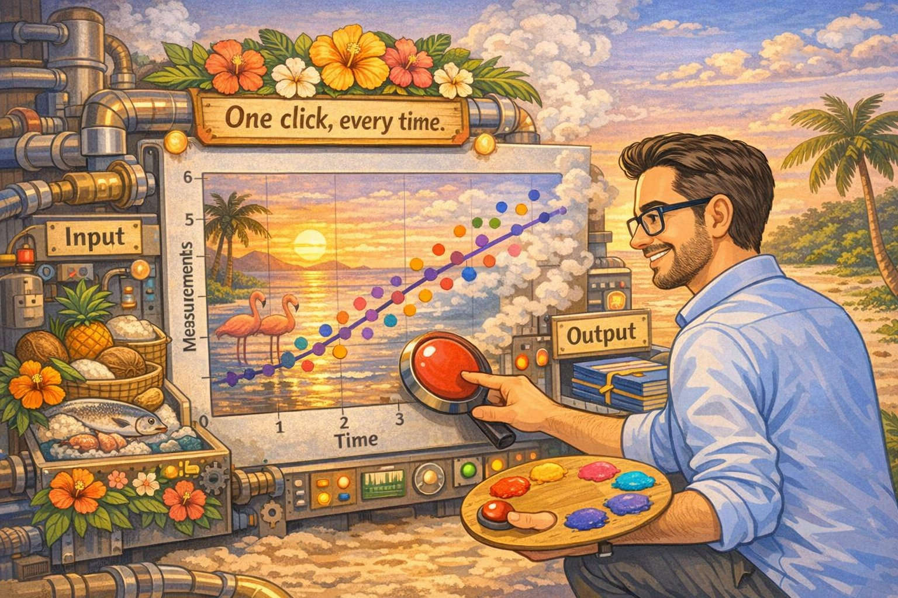

:::::::::::::::::::::::::::::::::::::: questions

- How do I combine my analysis and write-up in one document?
- What is R Markdown and why is it better than copy-pasting from SPSS output?
- How do I create a report that updates when data changes?

::::::::::::::::::::::::::::::::::::::::::::::::

::::::::::::::::::::::::::::::::::::: objectives

- Create an R Markdown document that combines text, code, and output
- Generate tables and figures that update automatically
- Export reports to Word, PDF, or HTML
- Understand why script-based reporting is more reliable than SPSS output export

::::::::::::::::::::::::::::::::::::::::::::::::

{alt="Cartoon of a researcher pressing a big red button on a tropical machine that converts raw data into a finished report"}

```{r episode6-data-load, echo = FALSE, message = FALSE, warning = FALSE}
library(tidyverse)
squad <- read_csv("data/blue_wave_squad.csv")
```

## The problem with copy-paste

If you have used SPSS for reporting, this workflow will feel familiar:

1. Run your analysis in SPSS
2. Get a table or chart in the Output window
3. Copy it
4. Paste it into your Word document
5. Write your interpretation around it
6. A colleague sends updated data
7. **Go back to step 1 and redo everything**

This workflow is fragile. Every time the data changes you re-run every analysis,
re-copy every table, and re-paste into your document. Along the way it is easy to
paste an old table, forget to update a number in the text, or lose track of which
version of the analysis matches your report.

R Markdown solves this. It lets you write your text **and** your analysis in a
single file. When the data changes you press one button and the entire report,
text, tables, figures, and all the numbers inside your sentences, updates.

::::::::::::::::::::::::::::::::::::: callout

## This is a research integrity question, not only a convenience

When your numbers and your text live in the same document, it is physically
impossible for them to drift apart. That matters for policy reports, academic
papers, and any situation where someone else relies on your numbers.

It matters more when the numbers are about people. The squad dataset behind this
course carries a confidence code on every row, and roughly one player in ten
could not be placed at a club at all. A report that hard-codes "72 percent play
abroad" into a Word file loses that context the moment the file leaves your
hands. A report that computes the figure at knit time can carry the caveat with
it, and update both together.

::::::::::::::::::::::::::::::::::::::::::::::::

## R Markdown basics

An R Markdown file is a plain text file with the extension `.Rmd`. It has three
types of content:

1. A **YAML header** at the top, metadata about the document
2. **Markdown text**, your writing
3. **Code chunks**, your R analysis

### The YAML header

Every R Markdown document starts with a block between `---` lines. This is the
YAML header, and it controls the document settings:

````
---
title: "Curaçao Squad Report 2026"
author: "Your Name"
date: "2026-09-15"
output: word_document
---
````

The `output` line controls the format of your final document:

| Output format      | What you get            |
|--------------------|-------------------------|
| `word_document`    | A .docx Word file       |
| `html_document`    | A web page              |
| `pdf_document`     | A PDF (requires LaTeX)  |

For most government and policy work `word_document` is the most practical
choice. Your colleagues can open it, comment on it, and print it without
installing anything.

::::::::::::::::::::::::::::::::::::: callout

## Start with Word, explore later

We recommend `word_document` for this course because it fits the workflow most
SPSS users already have. Once you are comfortable, try `html_document`. It
supports interactive tables and plots, and it is what the capstone report at the
end of this episode uses.

::::::::::::::::::::::::::::::::::::::::::::::::

### Markdown text formatting

Between your code chunks you write normal text using **Markdown**, a simple way
to format text with plain characters:

```
# First-level heading
## Second-level heading
### Third-level heading

**bold text**
*italic text*

- Bullet point one
- Bullet point two

1. Numbered item one
2. Numbered item two

[Link text](https://example.com)
```

That is all you need for most reports. If you have used WhatsApp or Slack
formatting, this will feel familiar.

### Code chunks

A code chunk is where your R code lives. It starts with ` ```{r} ` and ends with
` ``` `:

````
```{r}`r ''`
library(tidyverse)
squad <- read_csv("data/blue_wave_squad.csv")
table(squad$team_code)
```
````

When you knit the document, R runs the code and places the output directly into
your report. No copying, no pasting.

#### Chunk options

You control what appears in the final document by adding options to the chunk
header:

````
```{r, echo = FALSE, message = FALSE, warning = FALSE}`r ''`
library(tidyverse)
squad <- read_csv("data/blue_wave_squad.csv")
```
````

| Option              | What it does                                    |
|---------------------|-------------------------------------------------|
| `echo = FALSE`      | Hides the code, shows only the output           |
| `message = FALSE`   | Suppresses package loading messages             |
| `warning = FALSE`   | Suppresses warnings                             |
| `eval = FALSE`      | Shows the code but does not run it              |
| `fig.width = 8`     | Sets figure width in inches                     |
| `fig.height = 5`    | Sets figure height in inches                    |

For a polished report aimed at a non-technical audience you will typically set
`echo = FALSE` so readers see results but not code.

::::::::::::::::::::::::::::::::::::: callout

## `warning = FALSE` is not a fix

It is tempting to put `warning = FALSE` on every chunk so the report looks
clean. Remember what the warnings in Episode 4 were telling you: rows dropped
because of missing values. Suppressing the warning does not stop the rows being
dropped, it stops you finding out.

Set `warning = FALSE` at the end, once you have read every warning and know why
each one is there. Not at the start, to make them go away.

::::::::::::::::::::::::::::::::::::::::::::::::

### Inline R code

This is the feature that makes R Markdown powerful. You can embed R calculations
directly inside your sentences:

```
The dataset contains `r knitr::inline_expr("nrow(squad)")` players.
```

When knitted, this becomes:

> The dataset contains `r nrow(squad)` players.

If the data changes and you re-knit, that number updates. No more searching
through a Word document for every number that needs correcting.

### Knitting: from .Rmd to a finished document

To turn your `.Rmd` file into a Word document, or HTML, or PDF, you **knit** it.
In RStudio:

1. Click the **Knit** button at the top of the editor, the ball of yarn icon
2. R runs all your code chunks from top to bottom in a clean environment
3. The finished document appears

:::::::::::::::::::::::::::::::::::::::::::: instructor

## Common knitting problems

The most common issue is that knitting fails because the `.Rmd` file does not
load packages or data that earlier chunks depend on. Remind participants that
knitting starts from a **blank environment**. Every package and dataset must be
loaded within the `.Rmd` file itself, even if it is already loaded in their
current R session.

Another common issue is file paths. If participants write
`read_csv("data/blue_wave_squad.csv")`, the working directory during knitting is
the folder where the `.Rmd` file is saved. Make sure the data file is in the
right relative location.

Third, and specific to this dataset: encoding. If a participant's Windows locale
mangles the ç in Curaçao during knitting, have them save the `.Rmd` as UTF-8 via
**File > Save with Encoding**. It is worth mentioning pre-emptively rather than
debugging it live in four separate laptops.

::::::::::::::::::::::::::::::::::::::::::::::::

::::::::::::::::::::::::::::::::::::: callout

## Knitting runs everything fresh

A common mistake is to rely on objects you created in your R console but never
included in the `.Rmd` file. When you knit, R starts with a completely empty
workspace. If you get an error like "object not found", it usually means you
forgot to include the code that creates that object in your `.Rmd` file.

::::::::::::::::::::::::::::::::::::::::::::::::

## Building a mini-report

Let us build a short squad analysis report step by step. In RStudio:

1. Go to **File > New File > R Markdown...**
2. Enter a title like "Curaçao Squad Report"
3. Enter your name as author
4. Select **Word** as the default output format
5. Click **OK**

RStudio gives you a template document. Delete everything below the YAML header
and replace it with the following sections.

### Step 1: Setup chunk

The first code chunk in any report should load your packages and data. We hide
the code and messages because the reader does not need to see them.

```{r setup-demo, eval = FALSE}
# This would be at the top of your .Rmd file, after the YAML header:

# ```{r setup, message = FALSE, warning = FALSE, echo = FALSE}
library(tidyverse)
squad <- read_csv("data/blue_wave_squad.csv")
# ```
```

### Step 2: Write an introduction in Markdown

Below the setup chunk, write some context in plain Markdown:

```
## Introduction

This report summarises where the players called up to the four ABC
island national squads play their club football, using squad lists
compiled in 2026.
```

### Step 3: A summary table

Now add a code chunk that produces a summary table. The `knitr::kable()`
function turns a data frame into a formatted table in your output document:

```{r summary-table-demo, message = FALSE, warning = FALSE}
squad <- read_csv("data/blue_wave_squad.csv") |>
  mutate(
    island = if_else(str_starts(team_code, "CUW"), "Curaçao", "Aruba"),
    gender = if_else(str_ends(team_code, "M"), "Men", "Women"),
    based_abroad = !(club_country %in% c("CUW", "ABW", "X"))
  )

squad_summary <- squad |>
  group_by(island, gender) |>
  summarise(
    players    = n(),
    abroad     = sum(based_abroad),
    pct_abroad = round(100 * mean(based_abroad)),
    top_two    = sum(league_tier %in% c("1", "2")),
    .groups = "drop"
  ) |>
  arrange(desc(pct_abroad))

knitr::kable(squad_summary, col.names = c(
  "Island", "Squad", "Players", "Abroad", "% abroad", "Top two tiers"
))
```

### Step 4: A visualization

Add another chunk with a ggplot2 chart:

```{r vis-demo, message = FALSE, warning = FALSE, fig.width = 8, fig.height = 4.5}
ggplot(squad_summary, aes(x = reorder(paste(island, gender), pct_abroad),
                          y = pct_abroad)) +
  geom_col(fill = "#44759e", width = 0.7) +
  coord_flip() +
  labs(
    title = "Share of each squad playing club football off-island",
    x = NULL,
    y = "Percent of squad"
  ) +
  theme_minimal(base_size = 13)
```

### Step 5: Interpretation with inline R

Now write a paragraph that uses inline R to insert numbers directly:

```{r inline-prep, message = FALSE, warning = FALSE, echo = FALSE}
most  <- squad_summary |> slice_max(pct_abroad, n = 1)
least <- squad_summary |> slice_min(pct_abroad, n = 1)
```

In your `.Rmd` file you would write something like this:

````
The squad most dependent on players based overseas is the
`r knitr::inline_expr("paste(most$island, most$gender)")` team, at
`r knitr::inline_expr("most$pct_abroad")`%. The least dependent is
`r knitr::inline_expr("paste(least$island, least$gender)")`, at
`r knitr::inline_expr("least$pct_abroad")`%.
````

When knitted this becomes a complete sentence with real numbers, numbers that
update if the data ever changes.

### Step 6: Knit

Click the **Knit** button. RStudio generates a Word document with your
introduction, table, chart, and interpretation, in one step, from one file.

::::::::::::::::::::::::::::::::::::: callout

## Compare this to the SPSS workflow

You loaded data, computed a summary, created a chart, and wrote an interpretation
with automatically calculated numbers, all in a single file. If the squad list is
updated after the next international window, you re-knit and the entire report
updates. No manual copy-paste. No version confusion.

::::::::::::::::::::::::::::::::::::::::::::::::

## A complete example

Here is what a minimal but complete `.Rmd` file looks like, all in one place:

````
---
title: "ABC Islands Squad Report"
author: "Your Name"
date: "`r knitr::inline_expr("Sys.Date()")`"
output: word_document
---

```{r setup, message = FALSE, warning = FALSE, echo = FALSE}`r ''`
library(tidyverse)
squad <- read_csv("data/blue_wave_squad.csv") |>
  mutate(
    island = if_else(str_starts(team_code, "CUW"), "Curaçao", "Aruba"),
    based_abroad = !(club_country %in% c("CUW", "ABW", "X"))
  )
```

## Overview

This report summarises where the 2026 ABC island national squads play.

```{r summary-table, echo = FALSE}`r ''`
by_island <- squad |>
  group_by(island) |>
  summarise(players = n(), abroad = sum(based_abroad))

knitr::kable(by_island, col.names = c("Island", "Players", "Abroad"))
```

```{r composition-chart, echo = FALSE, fig.width = 7, fig.height = 4}`r ''`
ggplot(squad, aes(x = team_code, fill = league_tier)) +
  geom_bar(position = "fill") +
  scale_y_continuous(labels = scales::percent) +
  labs(title = "Squad composition by league tier", x = NULL, y = NULL) +
  theme_minimal()
```

## Key findings

```{r findings, echo = FALSE}`r ''`
cuw <- by_island |> filter(island == "Curaçao")
aru <- by_island |> filter(island == "Aruba")
gap <- round(100 * (cuw$abroad / cuw$players - aru$abroad / aru$players))
```

Curaçao fields `r knitr::inline_expr("cuw$abroad")` of
`r knitr::inline_expr("cuw$players")` players from clubs off the island, against
`r knitr::inline_expr("aru$abroad")` of `r knitr::inline_expr("aru$players")` for
Aruba, a gap of `r knitr::inline_expr("gap")` percentage points.
````

::::::::::::::::::::::::::::::::::::: challenge

## Challenge 1: Create a squad report

Create a new R Markdown document, File > New File > R Markdown, and build a short
report that does the following:

1. Loads `data/blue_wave_squad.csv`
2. Produces a summary table showing **the number of players by position and
   league tier** for one squad of your choice, using `knitr::kable()`
3. Creates a **bar chart** of club country for that squad
4. Includes at least **one inline R value** in a written interpretation sentence
5. Knits to Word

:::::::::::::::::::::::: solution

## Solution

One way to approach it. Your file would look like this:

````
---
title: "Curaçao Men's Squad, 2026"
author: "Your Name"
date: "`r knitr::inline_expr("Sys.Date()")`"
output: word_document
---

```{r setup, message = FALSE, warning = FALSE, echo = FALSE}`r ''`
library(tidyverse)
squad <- read_csv("data/blue_wave_squad.csv")
this <- filter(squad, team_code == "CUW-M")
```

## Squad composition

```{r position-table, echo = FALSE}`r ''`
knitr::kable(table(this$position, this$league_tier))
```

```{r country-chart, echo = FALSE, fig.width = 7, fig.height = 4}`r ''`
this |>
  filter(club_country != "X") |>
  count(club_country, sort = TRUE) |>
  ggplot(aes(x = reorder(club_country, n), y = n)) +
  geom_col(fill = "#44759e") +
  coord_flip() +
  labs(title = "Club country", x = NULL, y = "Players") +
  theme_minimal()
```

## Interpretation

```{r top-country, echo = FALSE}`r ''`
top <- this |>
  filter(club_country != "X") |>
  count(club_country, sort = TRUE) |>
  slice(1)
unknown <- sum(this$club_country == "X")
```

The largest single destination is `r knitr::inline_expr("top$club_country")`,
which accounts for `r knitr::inline_expr("top$n")` of the
`r knitr::inline_expr("nrow(this)")` players called up.
`r knitr::inline_expr("unknown")` players could not be placed at a club and are
excluded from the chart above.
````

Note the last sentence. The exclusion is written into the report by the same
code that performs it, so the two can never disagree.

:::::::::::::::::::::::::::::::::

::::::::::::::::::::::::::::::::::::::::::::::::

## Capstone: a full report from one command

The capstone of this course is a single R Markdown file that produces a polished,
self-contained report at the press of the Knit button. The worked example is the
squad report you saw in Episode 1's opening, opened now with the skills from this
episode in hand.

Pull the template and its stylesheet from the course repository into your
workshop folder:

```{r capstone-download, eval = FALSE}
# Iteration: 1
base <- "https://raw.githubusercontent.com/University-of-Aruba/blue-wave-analytics/main/episodes/files"

download.file(file.path(base, "blue-wave-squad-report-template.Rmd"),
              "blue-wave-squad-report-template.Rmd")
download.file(file.path(base, "blue-wave-report.css"),
              "blue-wave-report.css")

file.edit("blue-wave-squad-report-template.Rmd")
```

Both files land next to each other in the working directory, which is what the
knit step needs. The template expects the data in a `data` subfolder, which is
where you put it in Episode 2.

Walk through its structure: a YAML header with a `params` block, a hidden setup
chunk, a handful of analysis chunks, and prose with inline R for the narrative
numbers. Everything above in this episode is inside that template. The capstone
is assembly, not new material.

::::::::::::::::::::::::::::::::::::: callout

## One template, four reports

Look at the top of the template:

```yaml
params:
  team: "CUW-M"
  data_dir: "data"
```

Every reference to a specific squad inside the document goes through
`params$team`. Change that one line to `"ARU-W"`, knit again, and you get the
Aruba women's report: different numbers, different charts, different sentences,
same file.

This is the idea the whole course has been building toward. You have not written
a report. You have written a thing that writes reports.

::::::::::::::::::::::::::::::::::::::::::::::::

::::::::::::::::::::::::::::::::::::: keypoints

- R Markdown combines your analysis and write-up in a single document
- When data changes, re-knitting updates every table and figure automatically
- You can output to Word, PDF, or HTML from the same source file
- Inline R code puts computed numbers inside your sentences, so text and results cannot drift apart
- Write your caveats into the code that produces them, so they travel with the number
- Parameterise a report and one file serves every subgroup in your data

::::::::::::::::::::::::::::::::::::::::::::::::
