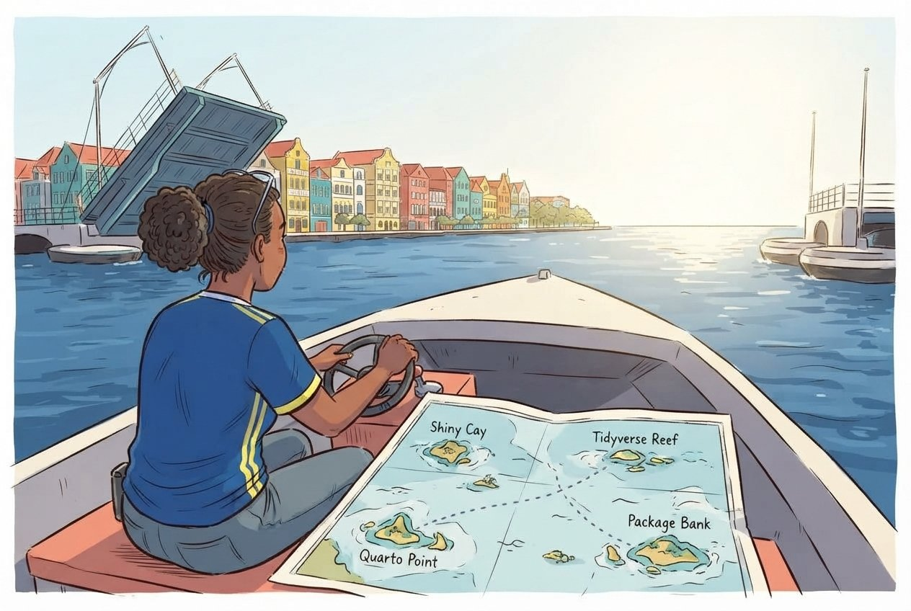

:::::::::::::::::::::::::::::::::::::: questions

- Where do I find help when I get stuck?
- What resources are available for continued learning?
- How do I access Dutch Caribbean data directly from R?

::::::::::::::::::::::::::::::::::::::::::::::::

::::::::::::::::::::::::::::::::::::: objectives

- Know where to find help: documentation, community forums, Stack Overflow
- Access Dutch Caribbean data using R packages (cbsodataR, WDI)
- Build a personal library of R scripts that replace SPSS workflows
- Understand the Carpentries community and further learning paths

::::::::::::::::::::::::::::::::::::::::::::::::

{alt="Cartoon of a researcher on a sailboat studying a treasure map of R learning destinations like Packages Cove and Tidyverse Peak"}

## Getting help

Everyone gets stuck. The difference between a beginner and an experienced R user
is not that experienced users never see errors. It is that they know where to
look when they do. Here are the most useful help resources, in order of how
quickly they give you an answer.

### Built-in documentation

Every R function has a help page. Access it in two ways:

```{r help-demo, eval = FALSE}
# These two are equivalent:
?mean
help("mean")
```

The help page shows what arguments the function takes, what it returns, and
usually includes examples at the bottom. The examples are often the most useful
part, so scroll down to them first.

::::::::::::::::::::::::::::::::::::: callout

## Tip: run the examples

At the bottom of most help pages there is an Examples section. You can run all
of them at once with:

```{r example-demo, eval = FALSE}
example(mean)
```

This is a fast way to see what a function does without reading the full
documentation.

::::::::::::::::::::::::::::::::::::::::::::::::

### Posit cheat sheets

Posit, the company behind RStudio, publishes two-page cheat sheets for the most
popular packages. Print these out or keep them open on a second screen:

- **Data import:** `readr`, `readxl`
- **Data transformation:** `dplyr`
- **Visualization:** `ggplot2`
- **R Markdown**

Find them all at [https://posit.co/resources/cheatsheets/](https://posit.co/resources/cheatsheets/)

### R Graph Gallery

**R Graph Gallery** ([https://r-graph-gallery.com](https://r-graph-gallery.com))
is a searchable catalogue of ggplot2 examples with the full code for each one.
When you know roughly what kind of chart you want but not the syntax to build it,
this is where to start.

### Stack Overflow

Stack Overflow has a large collection of R questions and answers. When searching,
add `[r]` to your search to filter for R-specific content:

```
site:stackoverflow.com [r] how to rename columns dplyr
```

Before posting your own question, search first. Most beginner questions have
already been answered. When you do post, include a **minimal reproducible
example**, a small piece of code that someone else can run to see your problem.

### Posit Community

The Posit Community forum ([https://community.rstudio.com](https://community.rstudio.com))
is a friendlier, more focused alternative to Stack Overflow. It is specifically
for R and RStudio questions, and the community is welcoming to beginners.

### R-bloggers

[R-bloggers](https://www.r-bloggers.com/) aggregates hundreds of R blogs. It is a
good place to discover tutorials, new packages, and practical examples. You can
subscribe to the email newsletter for a daily digest.

## Dutch Caribbean data in R

One practical advantage of R over SPSS is that you can pull data directly from
online sources into your session, with no manual downloads and no saving `.sav`
files. Here are the sources most relevant to work in the Dutch Caribbean.

### CBS Netherlands with cbsodataR

The `cbsodataR` package connects directly to CBS (Statistics Netherlands)
StatLine, which includes data for the BES islands, Bonaire, Sint Eustatius, and
Saba, and sometimes Aruba, Curaçao, and Sint Maarten.

```{r cbs-install, eval = FALSE}
# Install the package (only needed once):
install.packages("cbsodataR")
```

```{r cbs-demo, eval = FALSE}
library(cbsodataR)

# Browse available tables (there are thousands):
tables <- cbs_get_datasets()

# Search for Caribbean tables:
caribbean_tables <- tables |>
  dplyr::filter(grepl("Caribisch|Caribbean|Curacao|Bonaire", Title,
                      ignore.case = TRUE))

# View what we found:
head(caribbean_tables[, c("Identifier", "Title")], 10)
```

Once you find a table of interest, download it directly:

```{r cbs-download, eval = FALSE}
# Check cbs_get_datasets() for current table identifiers
pop_data <- cbs_get_data("83698ENG")

head(pop_data)
```

::::::::::::::::::::::::::::::::::::: callout

## Finding the right table

CBS has thousands of tables, and the identifiers like "83698ENG" change over
time. The safest approach is to:

1. Search on [opendata.cbs.nl](https://opendata.cbs.nl) in your browser
2. Find the table you want
3. Copy the identifier from the URL
4. Use that identifier in `cbs_get_data()`

::::::::::::::::::::::::::::::::::::::::::::::::

### World Bank data with WDI

The `WDI` package pulls data from the World Bank's World Development Indicators.
This is useful for comparing Curaçao to Aruba, Sint Maarten, and other small
island states.

```{r wdi-install, eval = FALSE}
# Install the package (only needed once):
install.packages("WDI")
```

A working example that pulls GDP per capita for Curaçao:

```{r wdi-demo, message = FALSE, warning = FALSE}
library(WDI)

# Country code for Curaçao is "CW" in the World Bank's two-letter scheme
curacao_gdp <- WDI(
  country = "CW",
  indicator = "NY.GDP.PCAP.CD",
  start = 2000,
  end = 2023
)

# Clean up column names
names(curacao_gdp)[names(curacao_gdp) == "NY.GDP.PCAP.CD"] <- "gdp_per_capita"

# Show the most recent years
tail(curacao_gdp[, c("year", "gdp_per_capita")], 10)
```

You can compare several countries at once:

```{r wdi-compare, eval = FALSE}
library(WDI)
library(ggplot2)

# Compare Curaçao (CW), Aruba (AW), and Sint Maarten (SX)
island_gdp <- WDI(
  country = c("CW", "AW", "SX"),
  indicator = "NY.GDP.PCAP.CD",
  start = 2000,
  end = 2023
)

names(island_gdp)[names(island_gdp) == "NY.GDP.PCAP.CD"] <- "gdp_per_capita"

ggplot(island_gdp, aes(x = year, y = gdp_per_capita, colour = country)) +
  geom_line(linewidth = 1) +
  labs(
    title = "GDP per capita, Dutch Caribbean comparison",
    x = "Year",
    y = "GDP per capita (current USD)",
    colour = "Country"
  ) +
  theme_minimal()
```

::::::::::::::::::::::::::::::::::::: callout

## Country codes are a recurring trap

The World Bank uses two-letter codes in `WDI()` (`CW`, `AW`, `SX`), the FIFA
dataset you used in Episode 5 uses three-letter ISO codes (`CUW`, `ABW`, `SXM`),
and CBS uses its own scheme. Half the joins that fail in real projects fail here.

The `islandcodes` package, developed at the University of Aruba and available on
CRAN, exists specifically to translate between them for small island states and
territories:

```{r islandcodes-demo, eval = FALSE}
install.packages("islandcodes")
library(islandcodes)
```

::::::::::::::::::::::::::::::::::::::::::::::::

### How to find World Bank indicator codes

The easiest way to find indicator codes is `WDIsearch()`:

```{r wdi-search, eval = FALSE}
# Search for indicators related to tourism:
WDIsearch("tourism")

# Search for indicators related to GDP:
WDIsearch("GDP per capita")
```

You can also browse indicators at
[https://data.worldbank.org/indicator](https://data.worldbank.org/indicator).

### Direct downloads from CBS Curaçao

CBS Curaçao ([https://www.cbs.cw](https://www.cbs.cw)) publishes data in Excel
and PDF format. There is no dedicated R package, but you can download and read
Excel files directly:

```{r cbs-curacao, eval = FALSE}
library(readxl)

# Download an Excel file to a temporary location:
url <- "https://www.cbs.cw/some-published-table.xlsx"
temp_file <- tempfile(fileext = ".xlsx")
download.file(url, temp_file, mode = "wb")

# Read it into R:
curacao_data <- read_excel(temp_file)
```

The same approach works for CBS Aruba ([https://cbs.aw](https://cbs.aw)).

### Open datasets from the University of Aruba

The University of Aruba maintains public reference datasets relevant to research
on the Dutch Caribbean and small island states. Both are CSV files hosted on
GitHub, so you can pull them into R without installing anything.

**Dutch Caribbean election results** at
[github.com/University-of-Aruba/CAS_election_data](https://github.com/University-of-Aruba/CAS_election_data).
A tidy dataset of votes by party for elections across Aruba (1985-2024), Curaçao
(2010-2025), and Sint Maarten (2010-2024). One row per party per election, with
columns for `year`, `country`, `party`, and `votes`.

```{r elections-demo, eval = FALSE}
# Read the CSV directly from GitHub
elections <- read.csv(
  "https://raw.githubusercontent.com/University-of-Aruba/CAS_election_data/main/dutch_caribbean_elections.csv"
)

# How fragmented has each Curaçao election been?
library(dplyr)
elections |>
  filter(country == "Curacao") |>
  group_by(year) |>
  summarise(
    parties = n(),
    total_votes = sum(votes),
    largest_share = round(100 * max(votes) / sum(votes), 1)
  ) |>
  arrange(year)
```

**Small island reference list** at
[github.com/University-of-Aruba/island-research-reference-data](https://github.com/University-of-Aruba/island-research-reference-data).
A country and territory list with classifications for SIDS, SNIJ, World Bank
region, and income group. Designed for XLSForm survey tools such as KoboToolbox
and ODK, and equally useful as a lookup table to filter or join any other dataset
by country code.

```{r islands-demo, eval = FALSE}
library(dplyr)

countries <- read.csv(
  "https://raw.githubusercontent.com/University-of-Aruba/island-research-reference-data/main/countries/countries_reference_xlsform.csv"
)

sids <- countries |>
  filter(is_sids == 1) |>
  select(iso_code, label, wb_region, wb_income_group)

head(sids)
```

## A taste of text analysis

The tools you already know, `dplyr` for filtering and counting and `ggplot2` for
charts, are enough to start analysing text. You do not need a special package to
count words.

Here is a short sample of institutional Papiamentu. We will find its most
frequent meaningful words.

```{r text-demo, message = FALSE}
library(dplyr)
library(ggplot2)

text <- "Pais Kòrsou ta un isla den Karibe ku hopi hende kordial i un kultura
riku. E pueblo di Kòrsou ta biba di turismo, komersio i servisio públiko.
Gobièrnu di Kòrsou ta traha pa krea oportunidat pa tur siudadano. Nos idioma
Papiamentu ta e idioma prinsipal ku ta uni nos komo pueblo. E Dutch Caribbean
Data Community (DCDC) ta un red pa analista i trahadó di datos di henter e
region, ku enfoke riba kalidat, transparensia i kooperashon."

# Split the text into words, lowercase everything, strip punctuation
words <- text |>
  tolower() |>
  strsplit("[[:space:][:punct:]]+") |>
  unlist()

# Hand-curated Papiamentu stopwords: the short function words that carry
# little meaning on their own
stopwords_pap <- c("e", "un", "nos", "su", "tur", "di", "pa", "na", "ku",
  "riba", "den", "i", "o", "of", "si", "no", "ta", "lo", "por",
  "mester", "tin", "a", "aki", "ei", "kua", "mas", "komo", "")

# Count words, remove stopwords, keep the top 10
word_counts <- tibble(word = words) |>
  filter(!word %in% stopwords_pap) |>
  count(word, sort = TRUE) |>
  slice_head(n = 10)

ggplot(word_counts, aes(x = n, y = reorder(word, n))) +
  geom_col(fill = "#44759e") +
  labs(
    title = "Most frequent meaningful words",
    x = "Count",
    y = NULL
  ) +
  theme_minimal()
```

The same pattern works on any text: a column of survey comments, a PDF you have
read into R, a folder full of reports. The steps are always split into words,
lowercase, drop stopwords, count, chart.

::::::::::::::::::::::::::::::::::::: callout

## Your stopword list is an analytical choice

That `stopwords_pap` vector was written by hand, and it is written in Curaçao
orthography. Run the same code over an Aruban text, where the same words are
spelled `cu`, `y`, `ey`, `cual`, `como`, and half of it stops working. Words you
meant to drop survive, and your top-ten list fills with function words.

There is no neutral stopword list. Someone chooses what counts as meaningless,
and for a language with two written standards that choice is not only technical.
Whatever you build, publish the list alongside the result so a reader can see
what you removed.

::::::::::::::::::::::::::::::::::::::::::::::::

::::::::::::::::::::::::::::::::::::: callout

## Actual wordclouds

Bar charts communicate better than wordclouds for most analysis. Wordclouds are
fun to share, and sometimes right for a presentation slide. The `ggwordcloud`
package plugs straight into the ggplot2 workflow:

```{r wordcloud-demo, eval = FALSE}
install.packages("ggwordcloud")
library(ggwordcloud)

ggplot(word_counts, aes(label = word, size = n)) +
  geom_text_wordcloud() +
  scale_size_area(max_size = 20) +
  theme_minimal()
```

Install it when you have time after the course. Nothing else depends on it.

::::::::::::::::::::::::::::::::::::::::::::::::

## Building a personal script library

Over time you will write scripts that solve specific problems: cleaning a
particular dataset, running a standard analysis, producing a recurring report. Do
not let these disappear. Build a personal library.

### Practical tips

1. **Save every analysis as a `.R` or `.Rmd` file.** Never rely on your console
   history alone.

2. **Use clear file names** that describe what the script does:
   ```
   01_clean_squad_data.R
   02_quarterly_summary_report.Rmd
   03_composition_by_island_analysis.R
   ```

3. **Comment generously.** You will forget why you wrote something in three
   months. Write comments that explain the *why*, not just the *what*:

```{r comment-demo, eval = FALSE}
# Exclude players coded X: club could not be established from any source,
# so counting them as island-based would understate the diaspora share
squad_clean <- squad |>
  filter(club_country != "X")
```

4. **Create a project folder structure:**
   ```
   my-project/
   ├── data/          # Raw data files (never edit these)
   ├── scripts/       # R scripts for data cleaning and analysis
   ├── output/        # Generated reports and figures
   └── README.txt     # What this project is about
   ```

5. **Use RStudio Projects** (File > New Project) to keep everything together.
   Projects set your working directory automatically and keep your files
   organised.

::::::::::::::::::::::::::::::::::::: callout

## Your scripts are your institutional memory

In many small-island government offices, knowledge walks out the door when staff
transfer or retire. If your analyses live in commented scripts, the next person
can pick up where you left off, even if they only know basic R.

This is worth being deliberate about rather than hoping for. A script that only
you can run is a dependency on you. A script with a README, a data folder, and
comments explaining the judgement calls is capability that stays in the office.

::::::::::::::::::::::::::::::::::::::::::::::::

## Continued learning

### Free books and courses

- **R for Data Science** (2nd edition) by Hadley Wickham, Mine Cetinkaya-Rundel,
  and Garrett Grolemund. Free online at
  [https://r4ds.hadley.nz](https://r4ds.hadley.nz). This is the single best next
  step. It covers everything in this course in more depth, plus much more.

- **The Carpentries** offers free, community-taught workshops on R, Python, Git,
  and more. Lessons are at
  [https://carpentries.org/community-lessons/](https://carpentries.org/community-lessons/).

- **Posit Cloud** ([https://posit.cloud](https://posit.cloud)) gives you RStudio
  in your browser with free interactive primers. Good for practising without
  installing anything.

### Community

- **DCDC Network**, the Dutch Caribbean Digital Competence Network, is your
  regional peer network. If you are taking this course you are already part of
  it. Use it to share scripts, ask questions, and collaborate across the islands.

- **Posit Community** ([https://community.rstudio.com](https://community.rstudio.com)),
  ask questions, share your work, help others. The best way to learn is to teach.

- **TidyTuesday**, a weekly community data visualization challenge. Every
  Tuesday a new dataset is posted and people share their analyses:
  [https://github.com/rfordatascience/tidytuesday](https://github.com/rfordatascience/tidytuesday)

## Between-session practice assignment

The between-session practice assignment is a separate page so it can be handed to
you at the end of Day 1 and opened from any device overnight. See the
[Homework brief](homework.html) under the "For Learners" menu of this site.

::::::::::::::::::::::::::::::::::::: challenge

## Challenge 1: Pull World Bank data and visualize it

Use the `WDI` package to pull a World Bank indicator for Curaçao and create a
plot:

1. Load the `WDI` and `ggplot2` packages
2. Use `WDIsearch()` to find an indicator that interests you, for example
   international tourism arrivals, unemployment, or population
3. Use `WDI()` to download the data for Curaçao, country code `"CW"`
4. Create a line plot showing how the indicator changes over time
5. Add a meaningful title and axis labels

:::::::::::::::::::::::: solution

## Solution

An example using international tourism arrivals:

```{r wdi-challenge, eval = FALSE}
library(WDI)
library(ggplot2)

# Search for tourism-related indicators:
WDIsearch("international tourism, number of arrivals")

# ST.INT.ARVL = International tourism, number of arrivals
curacao_tourism <- WDI(
  country = "CW",
  indicator = "ST.INT.ARVL",
  start = 2000,
  end = 2023
)

names(curacao_tourism)[names(curacao_tourism) == "ST.INT.ARVL"] <- "arrivals"

# Remove rows where arrivals is missing
curacao_tourism <- curacao_tourism[!is.na(curacao_tourism$arrivals), ]

ggplot(curacao_tourism, aes(x = year, y = arrivals)) +
  geom_line(linewidth = 1, colour = "#44759e") +
  geom_point(size = 2, colour = "#44759e") +
  scale_y_continuous(labels = scales::comma) +
  labs(
    title = "International tourism arrivals to Curaçao",
    subtitle = "Source: World Bank World Development Indicators",
    x = "Year",
    y = "Number of arrivals"
  ) +
  theme_minimal()
```

Your indicator and chart will look different depending on which indicator you
chose, and that is fine. The skills are searching for an indicator, downloading
the data, and visualizing it.

If your series comes back short or full of gaps, that is not a mistake on your
part. Coverage for small island territories in international databases is patchy, and
noticing it is part of the work.

:::::::::::::::::::::::::::::::::

::::::::::::::::::::::::::::::::::::::::::::::::

::::::::::::::::::::::::::::::::::::: callout

## You are ready

You now know how to import data, transform it, visualize it, test hypotheses, and
produce automated reports, all in R. That is not everything, but it is a solid
foundation. The most important thing now is to **use it**. The next time you need
to analyse data, try doing it in R instead of SPSS. You will be slower at first,
and each time it gets easier. Everything you produce is reproducible and open to
challenge, which is a better position to argue from.

::::::::::::::::::::::::::::::::::::::::::::::::

## Open lab: your homework in action

The last slot of Day 2 is an open lab built around the
[homework brief](homework.html) you worked through between sessions.

Open your homework script. We will go around the room: a quick look at what each
of you built, any errors you kept in a comment at the top, and one thing you
would still like your script to do. The instructor works through extensions live.

Good extension targets, from lightest to heaviest:

1. **Refine the chart.** Try a second `geom_*`, a different colour mapping, or a
   facet. Re-run and see which version communicates best.
2. **Add a second summary.** Re-run `group_by()` and `summarise()` on a different
   grouping variable and compare.
3. **Text in your data.** If your dataset has a free-text column, survey
   comments, category labels, document titles, apply the split, stopword, count,
   chart pattern from the text-analysis section above.
4. **Move into R Markdown.** Lift your `.R` file into a new `.Rmd`, add a title
   and two sentences of prose, and knit it. You now have a one-page report.

Bring questions to the instructor and to the person next to you. The goal is that
you leave with a script you can run again next week on fresh data.

## Before you leave

Please take a few minutes to complete these short surveys. Your feedback helps us
improve the course and strengthens the DCDC Network.

**Course evaluation**, tell us what worked, what did not, and what you would
change. This directly shapes future sessions.

[Complete the course evaluation survey](https://docs.google.com/forms/d/e/1FAIpQLSeq_hRNTbsBXCrvHRUYky8h4aHDAIzrjRjHEhGxdkzuTAwTyQ/viewform)

**DCDC Network onboarding**, help us understand your data practices and connect
you to the broader network. This feeds into DCDC research on digital competence
across the Dutch Caribbean.

[Complete the DCDC Network onboarding survey](https://docs.google.com/forms/d/e/1FAIpQLScMSYe1trO9g_ajjftEMLk0k1I8fXDUBiyOyydGTCh7xX7Dcw/viewform)

:::::::::::::::::::::::::::::::::::::::::::: instructor

## Before delivery: two things to replace

The two survey links above are the Aruba pilot's forms. Either create Curaçao
cohort forms and swap the URLs, or accept mixed responses across editions and
add a cohort question to the existing forms. Decide before promotion goes out,
not on the morning.

The Papiamentu sample text in the text-analysis section is written in Curaçao
orthography, which differs from the Aruban standard used in the master course.
That was deliberate for this room. If you would rather teach it as a comparison,
the Aruban version of the same passage is in the master course repository and
running both through the same stopword list makes the point in the callout
better than the callout does.

::::::::::::::::::::::::::::::::::::::::::::::::::::::::

::::::::::::::::::::::::::::::::::::: keypoints

- R has a large, active community, so you are never stuck alone
- `cbsodataR` and `WDI` pull Dutch Caribbean data directly into R
- Country coding schemes differ between sources, and that is where most joins break
- A stopword list is an analytical choice; publish it with your results
- Save your analyses as scripts and build a personal reference library
- The DCDC Network is your regional peer community for continued learning

::::::::::::::::::::::::::::::::::::::::::::::::
