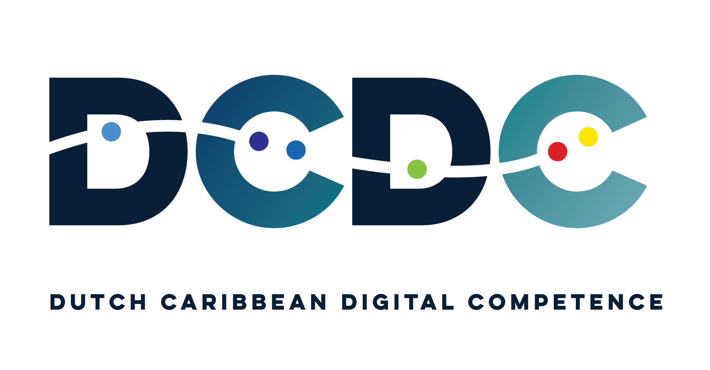

{alt='DCDC Network logo' width='300px'}

# Blue Wave Analytics: Introduction to R

A hands-on workshop that builds on what you already know from SPSS to get you
productive in R. No programming experience required. By the end you will be
importing data, reshaping it, making publication-quality charts, fitting a
simple model, and working in a script you can rerun.

We learn on the squad that took Curaçao to the World Cup. An island of 149,000
people put 26 professional footballers on a pitch, almost none of whom play
their club football on the island. That is a data question before it is a
football question, and it is the kind of question you will be able to answer
yourself by the end of the second day.

This course is the Curaçao edition of
[Introduction to R for SPSS Users](https://university-of-aruba.github.io/r-for-spss-users/),
developed by **Rendell de Kort** ([University of Aruba](https://www.ua.aw/) /
[DCDC Network](https://dcdc.network)) and delivered with **Marjorie Alfonso**.
It is open and freely reusable under a CC-BY 4.0 license.

::::::::::::::::::::::::::::::::::::: callout

## The football is the vehicle, not the payload

You will not learn expected goals, expected threat, or anything else from the
analytics literature here. This is an introduction to R. The squad data is
what we compute on because a local stake helps people learn, and because the
dataset happens to be an honest one with real gaps in it. What you take away
is R, and it will work just as well on your own survey, your own budget file,
or your own thesis data.

::::::::::::::::::::::::::::::::::::::::::::::::

## Schedule

Two teaching days with a gap day between them, at the University of Curaçao.
**Wednesday 23 and Friday 25 September 2026, 9:00 to 16:00** on both days.
Lunch and coffee breaks are built in. Each topic links to its episode so you
can jump straight to the material.

*Room to be confirmed with the local coordinator. Registration: https://forms.gle/QbH1iyszxQDqKhvb7*

### Day 1 - Wednesday 23 September

| Time          | Topic                                                              |
|---------------|--------------------------------------------------------------------|
| 09:00 – 09:10 | Welcome and introductions                                          |
| 09:10 – 09:55 | [Episode 1 — The case for switching](01-why-r.html)                |
| 09:55 – 10:10 | *Coffee break*                                                     |
| 10:10 – 11:40 | [Episode 2 — Your first R session](02-first-r-session.html)        |
| 11:40 – 12:00 | Questions and consolidation                                        |
| 12:00 – 13:00 | *Lunch*                                                            |
| 13:00 – 14:30 | [Episode 3 — Data manipulation](03-data-manipulation.html)         |
| 14:30 – 14:45 | *Afternoon break*                                                  |
| 14:45 – 15:45 | [Episode 4 — Your first visualization](04-visualization.html)      |
| 15:45 – 16:00 | Wrap-up and [homework brief](homework.html)                        |

::::::::::::::::::::::::::::::::::::: callout

## Between Day 1 and Day 2: the homework

The 48 hours between the two days is when the course content becomes a skill.
A short practice assignment is waiting for you on a dedicated page, so you can
reopen it from any device overnight:

### **→ [Day 1 homework brief](homework.html)**

Pick a dataset you already use, write a short R script that imports it,
transforms it, summarises it, and charts it. Thirty to sixty minutes is
plenty. Bring the script to the Day 2 open lab.

::::::::::::::::::::::::::::::::::::::::::::::::

### Day 2 - Friday 25 September

| Time          | Topic                                                                       |
|---------------|-----------------------------------------------------------------------------|
| 09:00 – 09:30 | [Day 1 recap](files/day1-recap.html) and troubleshooting                    |
| 09:30 – 09:45 | *Short break*                                                               |
| 09:45 – 10:45 | [Episode 5 — Statistical analysis, part 1](05-statistical-analysis.html)    |
| 10:45 – 11:00 | *Coffee break*                                                              |
| 11:00 – 11:35 | [Episode 5 — Statistical analysis, part 2](05-statistical-analysis.html)    |
| 11:35 – 11:45 | *Stretch break*                                                             |
| 11:45 – 12:00 | Episode 5 consolidation and questions                                       |
| 12:00 – 13:00 | *Lunch*                                                                     |
| 13:00 – 14:00 | [Episode 6 — Reproducible reporting](06-reproducible-reporting.html)        |
| 14:00 – 14:15 | *Afternoon break*                                                           |
| 14:15 – 15:00 | [Episode 7 — Where to go from here](07-next-steps.html)                     |
| 15:00 – 15:45 | Open lab                                                                    |
| 15:45 – 16:00 | Wrap-up and next steps                                                      |

## Who is this for?

Anyone who currently uses SPSS and wants to move to a free and more capable
alternative. You do not need programming experience. If you are comfortable
with means, standard deviations, and hypothesis testing, you have enough to
start.

**Students**
: Using SPSS for coursework or thesis research and looking for a cost-free alternative

**Lecturers**
: Teaching research methods and interested in integrating open-source tools into courses

**Researchers**
: Seeking reproducible analysis workflows and better visualization capabilities

**Institutional analysts**
: Working with data in government, healthcare, or policy and paying for software licenses

## Before you arrive

Install R and RStudio ahead of the first day, following the
[setup instructions](setup.html). Two optional online install clinics run in
the week before the course. Bring your own laptop if you have one; the
research lab is the fallback.
