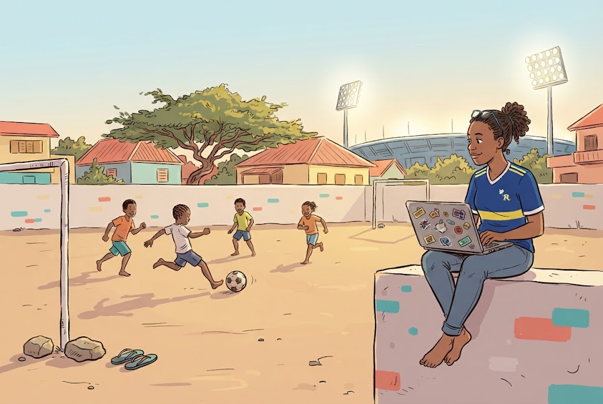

{alt='DCDC Network logo' width='300px'}

# Blue Wave Analytics: Introduction to R

<!-- CARTOON SLOT: uncomment when fig/scene_0.jpg exists. Scene spec in instructors/scene-briefs.md
{alt="Cartoon of a Curacao football fan at a beach bar tracking her squad across a wall map strung with pins and yarn to ten different countries"}
-->

In 2025 Curacao, an island of about 149,000 people, qualified for the World
Cup. No smaller nation has ever done it. The Blue Wave got there with limited
infrastructure and a squad spread across club football in ten countries, and
it showed the world that a small island can perform on the biggest stage.

Football needs a ball. After that it runs on passion, perseverance and, when
things go your way, a little momentum. World-class data science has an
equipment list that is just as short. The software that analysts at central
banks and research universities use is free, and it runs on the laptop you
brought today. What is left is the practice.

That is what these two days are for: working towards world-class analysis and
visualization, starting with the Blue Wave's own squad data and finishing with
a script you can point at your own work.

You will start from what you already know in SPSS and finish with a script that
imports the squad list, reshapes it, charts it, tests it, and renders a document
you can run again when the next international window scrambles half the names.
No programming experience required. If you are comfortable with means, standard
deviations and hypothesis testing, you have enough to start.

One of the two tests you will run in Episode 5 comes back null. That is
deliberate. Reporting a result that refuses to be interesting is the thing you
will do most often in your own work, and it is the thing courses like this one
usually skip.

This course is the Curacao edition of
[Introduction to R for SPSS Users](https://university-of-aruba.github.io/r-for-spss-users/),
developed by **Rendell de Kort** ([University of Aruba](https://www.ua.aw/) /
[DCDC Network](https://dcdc.network)) and delivered with **Marjorie Alfonso**.
It is open and freely reusable under a CC-BY 4.0 license.

::::::::::::::::::::::::::::::::::::: callout

## The football is the vehicle, not the payload

You will not learn expected goals, expected threat, or anything else from the
analytics literature here. This is an introduction to R. The squad data is what
we compute on because a local stake helps people learn, and because the dataset
is an honest one with real gaps in it. What you take away is R, and it will work
just as well on your own survey, your own budget file, or your own thesis data.

::::::::::::::::::::::::::::::::::::::::::::::::

## Schedule

Two teaching mornings with a gap day between them, at the University of
Curacao. **Wednesday 23 and Friday 25 September 2026, 09:00 to 13:00** on both
days. Coffee breaks are built in and the course finishes before lunch. Each
topic links to its episode so you can jump straight to the material.

*Itanium Computer Room, University of Curacao, Willemstad.
Registration: https://forms.gle/QbH1iyszxQDqKhvb7*

### Day 1 - Wednesday 23 September

| Time          | Topic                                                              |
|---------------|--------------------------------------------------------------------|
| 09:00 - 09:10 | Welcome and introductions                                          |
| 09:10 - 09:45 | [Episode 1 - The case for switching](01-why-r.html)                |
| 09:45 - 10:50 | [Episode 2 - Your first R session](02-first-r-session.html)        |
| 10:50 - 11:05 | *Coffee break*                                                     |
| 11:05 - 12:05 | [Episode 3 - Data manipulation](03-data-manipulation.html)         |
| 12:05 - 12:15 | *Short break*                                                      |
| 12:15 - 12:50 | [Episode 4 - Your first visualization](04-visualization.html)      |
| 12:50 - 13:00 | Wrap-up and [homework brief](homework.html)                        |

::::::::::::::::::::::::::::::::::::: callout

## Between Day 1 and Day 2: the homework

The 48 hours between the two days is when the course content becomes a skill.
A short practice assignment is waiting for you on a dedicated page, so you can
reopen it from any device overnight:

### **-> [Day 1 homework brief](homework.html)**

Pick a dataset you already use, write a short R script that imports it,
transforms it, summarises it, and charts it. Thirty to sixty minutes is
plenty. Bring the script to the Day 2 recap; the first twenty minutes of
Friday are set aside for working through what you hit.

::::::::::::::::::::::::::::::::::::::::::::::::

### Day 2 - Friday 25 September

| Time          | Topic                                                                       |
|---------------|-----------------------------------------------------------------------------|
| 09:00 - 09:20 | [Day 1 recap](files/day1-recap.html), homework and troubleshooting          |
| 09:20 - 10:20 | [Episode 5 - Statistical analysis, part 1](05-statistical-analysis.html)    |
| 10:20 - 10:35 | *Coffee break*                                                              |
| 10:35 - 11:10 | [Episode 5 - Statistical analysis, part 2](05-statistical-analysis.html)    |
| 11:10 - 11:20 | *Short break*                                                               |
| 11:20 - 12:10 | [Episode 6 - Reproducible reporting](06-reproducible-reporting.html)        |
| 12:10 - 12:50 | [Episode 7 - Where to go from here](07-next-steps.html)                     |
| 12:50 - 13:00 | Wrap-up and next steps                                                      |

## Who is this for?

Anyone who currently uses SPSS and wants to move to a free and more capable
alternative. You do not need programming experience. If you are comfortable
with means, standard deviations, and hypothesis testing, you have enough to
start.

**Students**
: Using SPSS for coursework or thesis research and looking for a cost-free alternative

**Lecturers**
: Teaching research methods and interested in integrating open-source tools into courses

**Researchers**
: Seeking reproducible analysis workflows and better visualization capabilities

**Institutional analysts**
: Working with data in government, healthcare, or policy and paying for software licenses

## Before you arrive

Install R and RStudio ahead of the first day, following the
[setup instructions](setup.html). If something fails, reply to your
registration email with the error message and we will sort it before the day.
Bring your own laptop if you have one; the research lab is the fallback.
